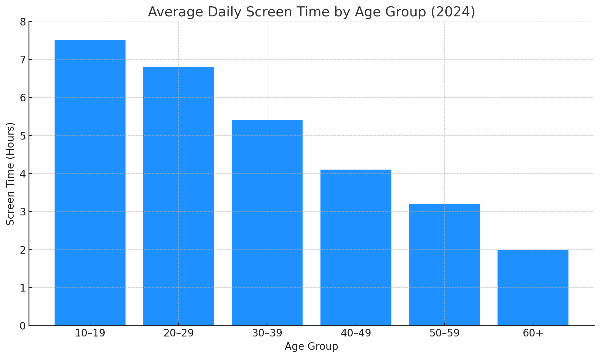

## Task1

> The bar chart below shows the average number of hours per day different age groups spent on screen-based devices in 2024.

The bar chart presents data on the average daily screen time across six age groups in 2024. It is evident that younger individuals spent significantly more time on screens than older age groups.

The highest screen usage was recorded among those aged 10-19, who spent an average of 7.5 hours daily. This figure gradually declined with age: 20-29-year-olds averaged 6.8 hours, while 30-39-year-olds spent around 5.4 hours. The 40-49 age group logged 4.1 hours, and screen time dropped further to 3.2 hours for those aged 50-59. The lowest figure was among those aged 60 and above, with just 2 hours per day.

The data indicates a clear inverse relationship between age and screen usage. Younger age groups particularly teenagers and young adults, are the most active digital users, like due to social media, entertainment, and education-related activities. In contrast, older generations tend to have less engagement with digital devices.

In summary, screen time is strongly age-dependent, with usage decreasing steadily as age increases.

## Task2

> Some people believe that the internet has brought people closer together, while others think that it has made people more isolated.
> Discuss both views and give your own opinion.

The internet is often hailed as a tool that connects people across the globe. However, while some argue that it fosters closeness, others believe it has led to greater social isolation. Both perspectives hold merit, but I personally believe the internet has overall brought people closer together.

Proponents of the internet's social benefits point to the ease of communication. Video calls, messaging apps, and social media allow people to stay connected with family and friends regardless of distance. In addition, online communities can offer support for individuals with shared interests or rare conditions, especially those who might struggle with in-person interactions.

Conversely, critics argue that digital communication has replaced face-to-face interaction. They claim that excessive use of social media may result in superficial relationships, reduced empathy, and a decline in real-world social skills. Furthermore, people who spend long hours online may neglect relationships in their immediate environment.

In my opinion, the key lies in how the internet is used. When leveraged wisely, it enhances human connection by bridging geographical gaps and providing new forms of interaction. However, overreliance on online communication at the expense of physical presence can lead to emotional distance.

In conclusion, while the internet can potentially isolate individuals, its overall effect has been to bring people closer-provided it is used to complement, rather than replace, real-life relationships.

## Vocabulary & Expressions

| Term / Expression | Definition | Simpler Paraphrase |
| --- | --- | --- |
| **Inverse relationship** | When one value increases as the other decreases | One goes up, the other goes down |
| **Digital users** | People who frequently use digital devices or the internet | People who use screens or the web |
| **Hailed as** | Praised or described as | Called or celebrated as |
| **Superficial relationships** | Connections lacking depth or sincerity | Shallow friendships |
| **Leverage** | To use something to maximum advantage | Make good use of something |
| **At the expense of** | Causing harm to something in order to benefit another | While hurting something else |
| **Emotional distance** | Lack of emotional closeness between people | Feeling far from someone emotionally |
