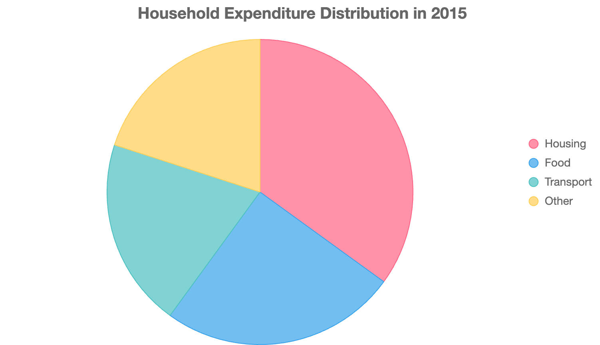
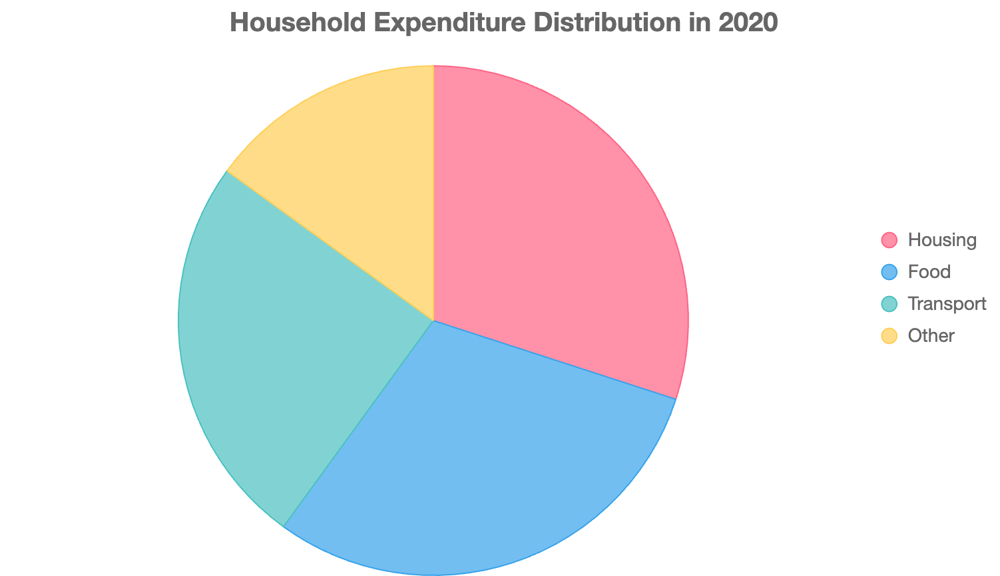

## Task1

> The pie charts below show the distribution of household expenditure in four categories (housing, food, transport, and other) in a country in 2015 and 2020.

| 2015 (%) | 2020 (%) |
|  --- | --- |
|  |  |

The pie charts illustrate the distribution of household expenditure across four categories-housing, food, transport, and other-in a country in 2015 and 2020. Overall, there was a noticeable shift in spending patterns, with food and transport increasing in proportion while housing and other expenses declined.

In 2015, housing accounted for the largest share at 35% followed by food at 25%, and both transport and other categories at 20% each. By 2020, food expenditure rose to 30%, equalling housing, which decreased to 30%. Transport expenditure increased to 25%, while the "other" category saw a reduction to 15%.

The most significant change was the 5-percentage-point increase in food expenditure, reflecting its growing importance in household budgets. Transport also gained prominence, rising by 5 percentage points, whereas housing lost its dominant position. The decline in the "other" category suggests a reallocation of funds toward essential expenses, likely driven by economic or lifestyle changes over the five-year period.

## Task2

> Some people believe that governments should invest heavily in public transportation to reduce traffic congestion and pollution. Others argue that improving road infrastructure is a more effective solution.
> Discuss both views and give your own opinion.

The debate over whether governments should prioritize public transportation or road infrastructure to address traffic congestion and pollution is multifaceted. Both approaches have merit, but their effectiveness depends on context. This essay will discuss both perspectives and present my own view.

Advocates of public transportation argue that it offers a sustainable solution to urban challenges. Efficient systems like buses, trains, and subways can transport large numbers of people, reducing the number of private vehicles on roads. For instance, cities like Tokyo have invested in extensive metro systems, significantly lowering per-capita emissions and easing traffic flow. Public transport is also more accessible to lower-income groups, promoting social equity. Furthermore, modern electric buses and trains can substantially reduce pollution, aligning with environmental goals.

Conversely, proponents of road infrastructure improvements argue that better roads enhance traffic efficiency. Widening highways, building flyovers, or implementing smart traffic systems can alleviate bottlenecks, as seen in cities like Dubai, where advanced road networks reduce travel times. Critics of public transport investments note that such projects are costly and time-consuming, and may not address immediate congestion issues in rapidly growing urban areas.

In my opinion, investing in public transportation is more effective in the long term. It addresses both congestion and pollution while promoting sustainable urban development. However, strategic road improvements can complement these efforts, particularly in areas with limited public transport infrastructure. A balanced approach, prioritizing public transport with targeted road enhancements, offers the most holistic solution to urban mobility challenges.
