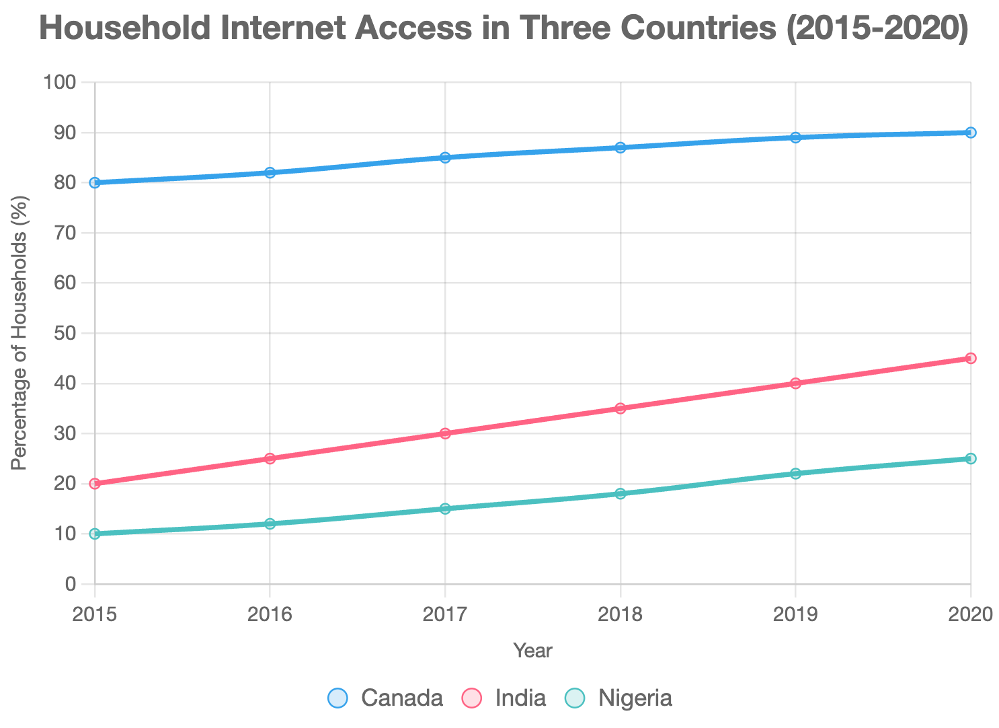

## Task1

> The line graph below shows the percentage of households with internet access in three countries (Canada, India, and Nigeria) from 2015 to 2020.

The line graph illustrates the proportion of households with internet access in Canada, India, and Nigeria from 2015 to 2020. Overall, all three countries experienced an upward trend in internet access, with Canada maintaining the highest levels, while Nigeria had the lowest throughout the period.

In 2015, Canada had the highest percentage of households with internet access at 80%, rising steadily to 90% by 2020. India started at 20% in 2015 and saw a consistent increase, reaching 45% by 2020. Nigeria, with the lowest initial access at 10%, grew to 25% over the same period.

Canada's internet penetration was significantly higher than that of India and Nigeria, reflecting its advanced infrastructure. India's growth rate was notable, doubling its percentage over five years, indicating rapid digital expansion. Nigeria, while showing progress, remained considerably behind, likely due to economic and infrastructural constraints. These trends highlight disparities in technological development across the countries, with Canada leading and Nigeria lagging.

## Task2

> The increasing use of social media among young people has raised concerns about its impact on mental health. What are the main causes of this issue, and what measures can be taken to address it?

The growing prevalence of social media among young people has sparked concerns about its detrimental effects on mental health. This essay will explore the primary causes of this issue and propose effective solutions to mitigate its impact.

One major cause is the pressure to conform to idealized online personas. Social media platforms often showcase curated lifestyles, leading to comparison and feelings of inadequacy among young users. For instance, exposure to influencers' polished images can trigger low self-esteem or anxiety. Additionally, excessive screen time, particularly late at night, disrupts sleep patterns, exacerbating stress and metal fatigue. Cyberbullying is another significant factor, as negative comments or harassment online can profoundly affect emotional well-being, especially among adolescents.

To address these issues, educational initiatives should be implemented to promote digital literacy. Schools could teach young people to critically evaluate social media content and recognize its artificial nature, reducing the urge to compare. For example, programs in Australia have successfully integrated media literacy into curricula, fostering healthier online habits. Governments and platforms should also enforce stricter anti-cyberbullying measures, such as real-time moderation and reporting systems. Furthermore, parents and schools can encourage balanced screen time by promoting offline activities, such as sports or hobbies, to enhance mental resilience.

In conclusion, social media's impact on young people's mental health stems from comparison, excessive use, and cyberbullying. By fostering digital literacy, strengthening platform regulations, and encouraging offline engagement, societies can alleviate these effects, ensuring young people maintain healthier relationships with social media.

## Vocabulary & Expressions

|Term/Expression|Definition|Simpler Paraphrase|
|---|---|---|
|**prominence**|The state of being important or noticeable|Importance|
|**conform**|To comply with rules or standards|Follow|
|**detrimental**|Causing harm or damage|Harmful|
|**exacerbating**|Making a problem or situation worse|Worsening|
|**resilience**|The ability to recover quickly from difficulties|Strength|
|**alleviate**|To make something less severe or intense|Reduce|
|**penetration**|The extent to which something is adopted or spread|Spread|
|**disparities**|Significant differences or inequalities|Gaps|
