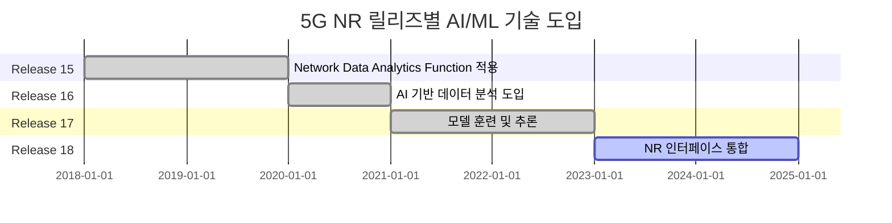
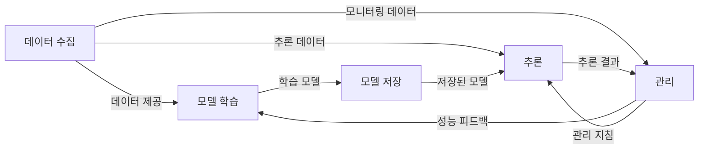

## 5G NR 개요

## 5G NR AI/ML 프레임워크 개념도, 핵심요소, 기대효과

### 5G NR AI/ML 프레임워크 개념도

### 5G NR AI/ML 프레임워크 핵심요소

| 구분 | 핵심요소 | 내용 |
| --- | --- | --- |
| 데이터 처리 | 데이터 수집 | AI/ML 학습 및 추론을 위해 네트워크 데이터를 수집 및 전처리 |
| 모델 관리 | 모델 학습 | 수집된 데이터를 기반으로 최적의 AI/ML 모델 학습 및 평가 |
| | 모델 저장 | 학습된 모델을 저장하여 추론 기능에서 활용 가능 |
| 모델 운영 | 추론 | 실시간 데이터 기반 추론으로 네트워크 상태를 진단 및 예측 |
| | 관리 | 성능 모니터링 및 피드백을 통해 네트워크 최적화와 모델 업데이트 수행 |

### 5G NR AI/ML 적용 기대효과

| 기술 | 내용 | 기대 효과 |
| --- | --- | --- |
| CSI 피드백 | 채널 상태 정보를 AI/ML로 예측하여 오버헤드 감소 | 데이터 전송 효율 및 정확도 향상 |
| 빔 관리 | 빔포밍, 빔 스위칭 등 AI 기반 관리 | 밀리미터파 대역에서 통신 성능 최적화 |
| 측위 정확도 향상 | NLOS 환경에서도 AI 기반 예측 기술 활용 | 고정밀 위치 추적 가능 |

## 5G NR AI/ML 적용시 고려사항

| 구분 | 고려사항 | 내용 |
| --- | --- | --- |
| 기술적 | 데이터 품질 | AI/ML 모델 학습 및 추론의 정확도를 보장하기 위한 고품질 데이터 필요 |
| | 모델 복잡성 | 적응형 네트워크 환경에서 실시간 추론이 가능하도록 경량화된 모델 설계 |
| 경제적 | 비용 효율성 | AI/ML 인프라 구축 및 운영 비용을 최소화하기 위한 클라우드 활용 |
| 운영적 | 표준화 | 다중 공급업체 환경에서 AI/ML 모델의 상호운용성을 보장하기 위한 표준 필요 |
| | 보안 | AI/ML 모델과 네트워크 데이터의 무결성을 보장하기 위한 보안 메커니즘 필요 |

## 참조

- [IITP: 주간기술동향 2157호](https://iitp.kr/kr/1/knowledge/periodicalViewA.it?searClassCode=B_ITA_01&masterCode=publication&identifier=1342)
