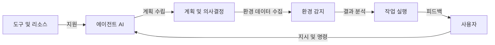
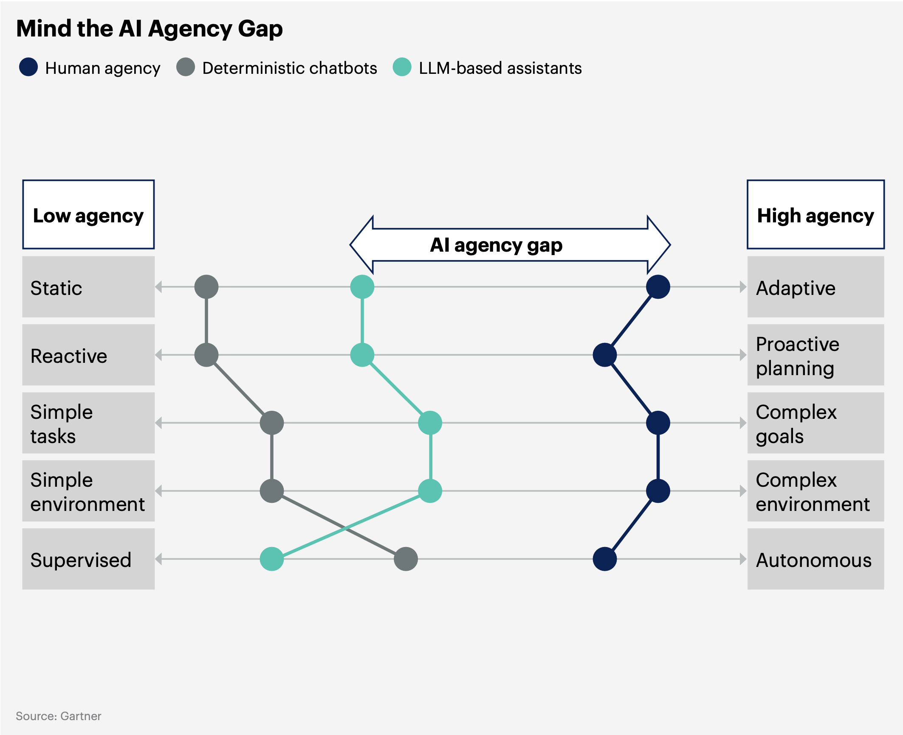

## 에이전트 AI 개념

- 특정 목표를 달성하기 위해 독립적으로 결정을 내리고 작업을 수행하는 자율적 소프트웨어
- 명시적 입력 없이 지침을 받고, 계획을 만들고, 도구를 사용하여 작업을 완료함

## 에이전트 AI 구성도, 핵심요소, 활용분야

### 에이전트 AI 구성도

### 에이전트 AI 핵심요소

| 구분 | 핵심요소 | 설명 |
| --- | --- | --- |
| 데이터 처리 | 메모리 | 과거 데이터를 저장하고 활용하여 의사결정 품질 향상 |
| 계획 및 실행 | 계획 | 목표를 달성하기 위한 작업 순서를 정의 |
| | 안전 지침 | 규제 및 윤리적 가이드라인 준수 |
| 환경 인식 및 활용 | 환경 감지 | 주변 환경의 상태를 모니터링하고 분석 |
| | 도구 활용 | 필요한 외부 리소스나 장치와의 상호작용 |

### 에이전트 AI 활용사례

| 분야 | 사례 | 기대 효과 |
| --- | --- | --- |
| 인공지능 에이전시 | 조직은 자동화 가능한 작업과 워크플로를 확대 | 업무 효율성 향상 및 운영 비용 절감 |
| | 기존 AI 코딩 어시스턴트를 고도화하여 개발자 역할 일부 대체 | 소프트웨어 개발 속도 향상 및 생산성 증가 |
| 기술 프로젝트 관리 | 자연어를 통해 소규모 자동화와 복잡한 기술 프로젝트 개발 및 관리 | 프로젝트 효율성 개선 및 자원 최적화 |
| 데이터 분석 및 예측 | 더 빠른 데이터 분석과 예측 인텔리전스를 통해 조직의 의사결정 개선 | 상황 인식 향상 및 전략적 의사결정 지원 |

## AI 에이전트와 에이전트 AI 비교

| 구분 | AI Agent | Agentic AI |
| --- | --- | --- |
| 개념 | 특정 작업을 수행하거나 문제를 해결하기 위해 사용자가 명령을 전달하는 도구적 AI | 자율적으로 목표를 설정하고 독립적으로 작업을 수행하는 지능형 AI |
| 작동 방식 | 명시적인 사용자 입력(프롬프트)에 의해 작동 | 목표와 환경 데이터를 기반으로 스스로 계획 및 실행 |
| 의사결정 범위 | 제한된 영역에서 사용자 정의 작업 수행 | 복잡한 환경에서 다목적 목표 달성을 위한 동적 의사결정 |
| 필요 기술 | 규칙 기반 처리, 간단한 환경 감지 | 메모리, 계획, 감지, 학습, 적응적 행동 |
| 활용 사례 | 챗봇, FAQ 자동화, 고객 지원 | 자율적 프로젝트 관리, 기업 운영 최적화, 상황 대응 |
| 제한사항 | 명령 기반, 높은 사용자 개입 필요 | 거버넌스 부족, 예측 불가능한 결과로 인한 위험 |

## 에이전시 AI 도입 위한 고려사항

| 구분 | 문제점 | 해결방안 |
| --- | --- | --- |
| 거버넌스 부족 | 추적 가능한 관리 체계 미흡 | 엄격한 거버넌스와 보호 장치 도입 |
| 데이터 품질 | 저품질 데이터에 의존 | 데이터 정제 및 검증 시스템 구축 |
| 신뢰성 문제 | 신뢰할 수 없는 의사결정 | 지속적 모니터링 및 성능 평가 도입 |
| 보안 위협 | 스마트 맬웨어 가능성 | 보안 강화 및 악의적 에이전트 탐지 기술 개발 |
