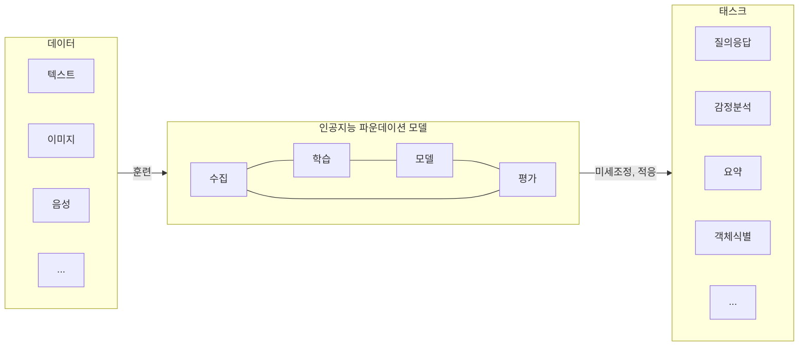

## 인공지능 파운데이션 모델 개념

- 대량의 무라벨 데이터로 학습되어 목적에 맞는 다운스트림 작업에 적용될 수 있는 일반화된 기초 모델
- 데이터의 증가와 하드웨어의 연산 속도 증가로 다양한 작업에서 높은 성능을 보여주는 파운데이션 모델 등장

## 인공지능 파운데이션 모델 개념도, 핵심요소, 기술동향

### 인공지능 파운데이션 모델 개념도

### 인공지능 파운데이션 모델 핵심요소

| 구분 | 요소 | 내용 |
| --- | --- | --- |
| 모델 | 방대한 학습데이터 | 텍스트, 이미지, 데이터 이해 |
| | 대규모 파라미터 | 최소 수억개 이상 파라미터 |
| 기술 | 트랜스포머 | 순차 데이터 내 관계 학습 |
| | Few-Shot 러닝 | 적은 양의 데이터로 미세 조정 |
| 기능 | 범용성 | 생성형 기반 추론 가능 |
| | 유연성 | 자연어 처리, 영상 인식 등 다수 분야 활용 |

### 인공지능 파운데이션 모델 기술동향

| 구분 | 모델 | 내용 |
| --- | --- | --- |
| OpenAI | Sora | 텍스트에서 영상 생성 |
| | GPT4o | 뛰어난 감정표현 가능 |
| X | Grok1.5 | 오픈소스기반 대규모 컨텍스트 처리 |
| Meta | Llama3.1 | 오픈소스기반, sLLM |

## 인공지능 파운데이션 모델 고려사항

- 지적재산권, 생성물저작권
- 모델 운영 전력, 훈련시 탄소배출 비용
- 편향, 환각 등 역기능 제거 노력, 윤리원칙 준수 필요
