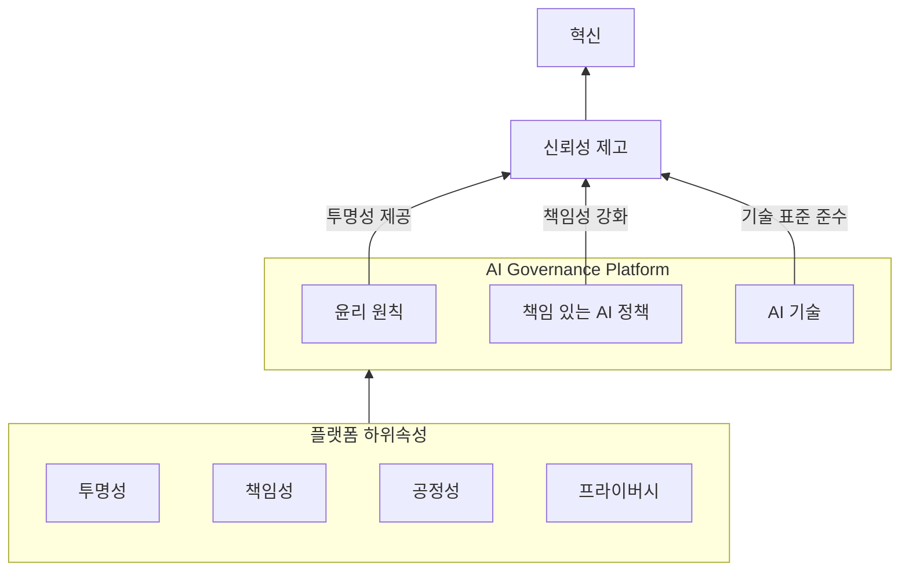
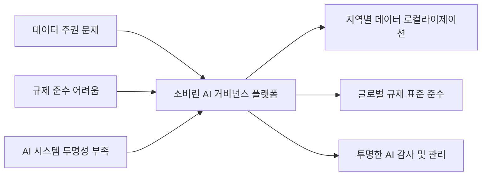

## AI 거버넌스 플랫폼 개념

- AI 시스템이 책임감 있고 윤리적으로 사용되도록 관리하고 제어하는 데 사용되며, ==AI의 신뢰성, 투명성, 공정성, 책임성을 확보하기 위한 프레임워크==
- 편향, 개인정보 침해, 사회적 영향 증가 / 조직 내 AI 사용시 내부가치와 사회적 기대 부합 필요 / 모델 수명주기 관리, 규정 준수, 책임성 확보

## AI 거버넌스 플랫폼 구성도, 구성요소, 활용사례

### AI 거버넌스 플랫폼 구성도

- AI 거버넌스 플랫폼을 통해 조직의 AI 윤리 감독 및 관리 자동화

### AI 거버넌스 플랫폼 구성요소

| 구분 | 구성 요소 | 설명 |
| --- | --- | --- |
| 윤리 (Ethics) | 윤리 원칙 | AI 개발 및 배포를 위한 도덕적 지침과 가이드라인 제공 |
| 정책 (Policies) | 책임 있는 AI 정책 | AI 관리, 감독, 배포를 위한 프레임워크 및 프로세스 |
| 기술 (Technology) | AI 기술 | 거버넌스 표준과 일치하는 기술적 역량 및 시스템 기능 |
| 플랫폼 속성 | 투명성 (Transparency) | AI의 의사결정 과정과 성능이 이해 가능하도록 명확히 제공 |
| | 책임성 (Accountability) | AI 시스템에서 발생하는 결과에 대한 책임 구조 마련 |
| | 공정성 (Fairness) | 데이터 편향을 방지하고 공정한 결과를 보장 |
| | 개인정보보호 (Privacy) | 데이터의 무결성과 보호를 위한 정책 및 기술 적용 |

### AI 거버넌스 플랫폼 활용사례

| 구분 | 사례 | 효과 |
| --- | --- | --- |
| 위험 평가 | AI 시스템이 초래할 수 있는 편향, 개인정보 침해 및 부정적 사회적 영향을 평가 | 잠재적 위험 감소와 AI의 윤리적 활용 보장 |
| 모델 수명 주기 관리 | 모델 거버넌스 프로세스를 통해 적절한 게이트와 제어를 적용하여 모델 수명 주기를 관리 | AI 모델의 윤리적 설계 및 배포를 보장 |
| 시스템 모니터링 및 감사 | AI 시스템 사용 현황을 추적하고 성능을 모니터링하며, 의사결정 과정을 감사하여 거버넌스 기준에 부합 | 지속적 규정 준수와 신뢰성 확보 |

## AI 거버넌스 플랫폼 수립시 고려사항

- 국가적 데이터 주권과 글로벌 규제 준수를 동시에 달성하는 소버린 AI 거버넌스 플랫폼으로의 테일러링 고려
