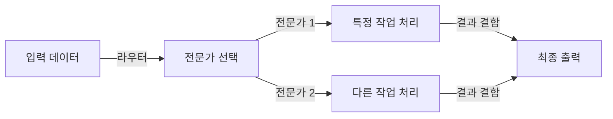

## 인공지능 모델 최적화 개념

- AI 모델의 성능, 효율성, 확장성을 극대화하기 위한 다양한 방법론
- DeepSeek 등 최신 LLM의 등장으로, 대규모 언어 모델의 학습 비용과 리소스 사용량 문제를 해결하기 위한 최적화 기법이 활성화
- 핵심 목표
  - 성능 개선: 복잡한 문제 해결을 위해 모델의 학습 능력과 추론 능력을 강화.
  - 효율성 향상: 대규모 모델의 리소스 사용량을 줄이고 운영 비용 절감.
  - 확장성 보장: 다양한 환경(클라우드, 엣지, 온디바이스)에서 유연하게 적용 가능한 모델 설계
- 필요성
  - LLM의 한계: 대규모 모델은 높은 정확도를 제공하지만, 학습/추론 비용이 매우 높음
  - 최적화 필요성: 실시간 처리가 필요한 모바일, IoT, 엣지 디바이스 등에서도 고품질 AI 서비스 제공을 위해 경량화된 모델 설계가 필수적

## GRPO, Group Relative Policy Optimization

| 구분 | 내용 |
| --- | --- |
| 개념 | 여러 정책 그룹을 생성하고, 각 그룹의 상대적인 성능을 비교하여 최적의 정책을 도출하는 PPO의 변형 기법 |
| 특징 | 그룹 기반 학습: 데이터를 서브 그룹으로 분할하여 독립적 학습 후 통합 |
| | 상대적 평가: 각 그룹의 성능을 비교하여 최적 정책 선택 |
| | Critic 모델 없이 그룹 점수 사용: 메모리 효율성 향상 |
| 예시 | DeepSeek 수학적 추론 성능 향상, 게임 AI, 로봇 제어 |

## MoE, 전문가 기반 혼합

> Mixture of Experts

| 구분 | 내용 |
| --- | --- |
| 개념 | 하나의 모델이 아닌, 여러 전문가 모델을 혼합하여 특정 작업에 적합한 전문가를 선택하는 기법 |
| 특징 | 확장성: 새로운 전문가 모델 추가로 시스템 확장 용이 |
| | 비용 효율성: 전체 모델보다 적은 리소스로 특정 작업 처리 가능 |
| | 분산 처리: 각 전문가 모델이 독립적으로 학습 및 실행 |
| | 동적 라우팅: 입력 데이터에 따라 적합한 전문가 선택으로 추론 속도 향상 |
| 예시 | LLM에서 의학/법률 특화 전문가 모델 사용, 이미지 분류시 카테고리 별 전문가 모델 |

## Distillation, 지식 증류

| 구분 | 내용 |
| --- | --- |
| 개념 | 성능이 우수한 대형 모델(Teacher)에서 학습한 지식을 소형 모델(Student)로 전이하여 성능 저하 없이 경량화된 모델을 만드는 기법 |
| 특징 | 모델 경량화: 대형 모델의 크기를 줄여 리소스 사용량 감소 |
| | 실시간 추론 지원: 엣지 디바이스에서도 빠른 응답 시간 제공 |
| | 성능 유지: 소형 모델에서도 높은 정확도 유지 |
| | 학습/운영 효율성: 학습 시간 단축 및 운영 비용 절감 |
| 예시 | 엣지컴퓨팅, 온디바이스AI, sLLM |

## CoT, Chain of Thought

| 구분 | 내용 |
| --- | --- |
| 개념 | 복잡한 문제를 논리적 단계로 분해하여 중간 결과를 생성하고, 이를 통해 최종 답변을 도출하는 기법 |
| 특징 | 해석 가능성: 단계별 사고로 문제 해결 과정을 명확화 |
| | 단계적 접근: 문제를 작은 단계로 나누어 해결 |
| | 복잡한 문제 해결: 다단계 문제 해결 능력 향상 |
| 예시 | 수학, 논리 문제, 질의 응답 시스템 |

## 인공지능 모델 최적화 기법 비교, 사례

### 인공지능 모델 최적화 기법 비교

| 구분 | GRPO | MoE | 지식 증류 | CoT |
| --- | --- | --- | --- | --- |
| 목적 | 정책 최적화 | 전문가 혼합 | 모델 압축 | 논리적 추론 |
| 적용 영역 | 강화학습 | 대규모 데이터 처리 | 리소스 제약 환경 | 복잡 문제 해결 |
| 특징 | 그룹별 상대적 평가 | 전문가 모델 혼합 | 대형 → 소형 모델 전환 | 단계적 추론 |
| 예시 | 다중 작업, 게임 AI, 로봇 제어 | 전문영역 언어모델, 이미지 처리 | 모바일 AI, 엣지 컴퓨팅 | 수학 문제, 질의응답 시스템 |
| 장점 | 정책 다양성 확보 | 작업별 전문성 발휘 | 경량화 및 효율성 | 명확한 추론 과정 제공 |
| 한계 | 계산 비용 증가 가능성 | 모델 관리 복잡성 증가 | 성능 저하 가능성 | 단순 문제에서는 비효율적 |

### 인공지능 모델 최적화 기법 사례

| 구분 | 내용 | 비고 |
| --- | --- | --- |
| 국내 | 네이버 클로바: 지식 증류 기법으로 경량화된 AI 모델 개발 | 모바일 서비스 적용 |
| | 삼성전자: CoT 기반 다단계 추론 모델 개발 | 스마트 가전 제품 적용 |
| 국외 | Google: MoE 기반 대형 언어 모델(PaLM) | 전문가 혼합 기술 활용 |
| | OpenAI: 지식 증류 기법으로 GPT 모델 경량화 | 모바일 및 웹 서비스 적용 |
| | DeepMind: GRPO 기반 강화학습 모델 | 게임 AI 및 로봇 제어 |
| | Meta: CoT 기반 다단계 추론 모델(LLaMA) | 논리적 사고 강화 |
| | DeepSeek: GRPO, MoE, 지식 증류, CoT 통합 활용 | 최신 AI 최적화 기법 적용 |
