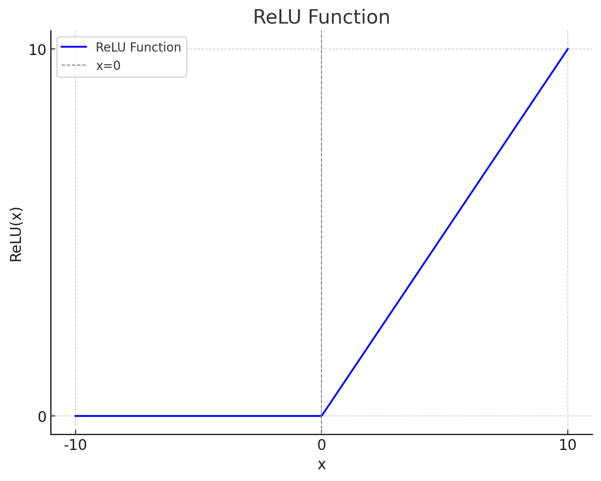

## 인공신경망의 개념, 구성요소

### 인공신경망 개념

- 인간의 뇌 신경 구조를 모방한 기계학습 모델로 뉴런 간 연결과 가중치를 통해 데이터를 학습하고 패턴을 인식

### 인공신경망 구성요소

| 구분 | 설명 | 비고 |
| --- | --- | --- |
| 입력층 | 학습을 위한 데이터 입력 계층 | 입력 데이터, 특징 |
| 은닉층 | 입출력층 사이에서 데이터 특징 추출 | 특징 추축, 학습, 가중치 |
| 출력층 | 최종 결과를 제공하는 층 | 결과 예측, 분류 |
| 가중치 | 뉴런 간 연결 강도를 나타내는 값 | 연결 강도, 학습 조정 |
| 활성화함수 | 뉴런의 출력값을 결정하는 함수 | 비선형성, 출력 결정 |

## 피드포워드 뉴럴네트워크 개념, 절차

### FNN 개념

- 입력값이 출력까지 순방향으로 전달되는 구조를 가진 인공신경망

### FNN 절차

| 절차 | 세부절차 | 설명 |
| --- | --- | --- |
| 초기화 | 모델 설계 | 인공신경망 구조 설계 |
| - | 가중치 초기화 | 가중치 및 편향 초기화 |
| 순방향 전파 | 데이터 전달 | 입력층에서 출력층까지 데이터 순방향 전달 |
| - | 예측값 계산 | 입력X가중치+편향 값에 활성화함수 적용 |
| 출력 | 출력값 계산 | 분류 및 회귀 출력 값 계산 |
| - | 검증 | 모델 성능 평가 |

---

## 역전파 개념, 절차

### 역전파 개념

- 역방향으로 오차를 전파시켜 각 층의 가중치를 업데이트하고 최적의 학습 결과를 찾아가는 방법

### 역전파 절차

| 단계 | 설명 | 세부 내용 |
|---|---|---|
| 순전파 | 입력 데이터를 통해 출력값 계산 | 입력층 → 은닉층 → 출력층으로 데이터 전달 |
| 오차 계산 | 출력값과 실제값 비교 | 손실 함수를 사용해 오차 계산 |
| 가중치 업데이트 | 역전파를 통해 가중치 조정 | 경사하강법으로 가중치 최적화 |

## 활성화함수 종류 및 역할

### 활성화함수 종류

| 구분 | 그래프 | 설명 |
|---|---|---|
| Sigmoid |  | 이진 분류 문제에 적합 경사 기울기 소실 문제 |
| ReLU |  | 음수는 0, 양수는 그대로 출력 DNN 가능, 계산 효율성 높음 |
| Tanh |  | Sigmoid보다 수렴속도 빠름 경사 기울기 소실 문제 |
| Leaky ReLU |  | ReLU 음수 기울기 문제 해결 x에 0.01 등 작은 값을 곱해줌 |
| Swish |  | ReLU보다 부드러운 활성화 함수 딥러닝 모델에서 성능 개선 음수에서 미세한 값 유지, 양수에서 x와 유사한 출력 |

### 활성화함수 역할

| 역할 | 설명 | 예시 |
|---|---|---|
| 비선형성 부여 | xor 등 복잡한 패턴을 학습할 수 있게 도움 | ReLU, Sigmoid |
| 출력값 제한 | 출력 값을 틍정 범위로 제한, 안정적 학습 | Sigmoid, Tanh |
| 계산 효율성 향상 | 불필요 계산을 줄이고 학습속도 개선 | ReLU 음수값 제거 |
