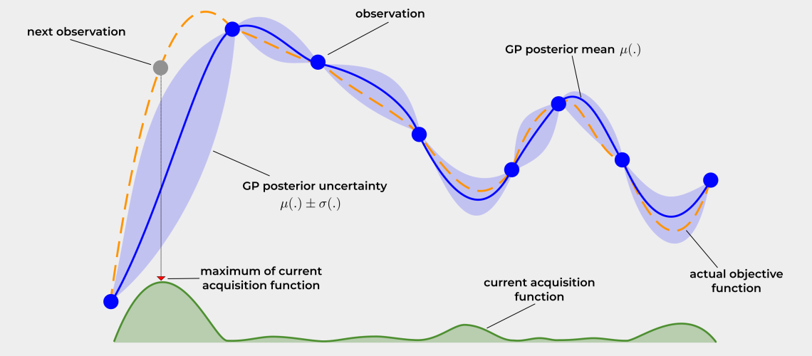

## 베이지안 최적화 개념

- 가우시안 프로세스 등 확률적 모델을 통해 함수 분포를 추정하고, 획득함수를 통해 탐색 지점을 결정하는 블랙박스 함수의 최적화 기법
- 기존 Grid Search, Random Search 기법 비효율 개선, 목적함수 평가 비용 최소화, 사전 지식을 통합한 확률적 모델 필요성

## 베이지안 최적화 개념도, 구성요소, 절차

### 베이지안 최적화 개념도

- [이미지 출처](https://firasalhafez.com/2021/05/12/finding-the-optimal-learning-rate-using-bayesian-optimization/>)

### 베이지안 최적화 구성요소

| 구분 | 내용 | 비고 |
| --- | --- | --- |
| 확률적 모델 | 데이터와 사전지식을 결합하여 함수 분포와 불확실성 모델링 | 가우시안 프로세스 등 |
| 목적함수 | 실제 최적값을 목표로 예측의 기준이 되는 함수 | 블랙박스 함수 |
| 획득함수 | 기존 입력값과 다음 최적값을 확률로 찾는 함수 | 탐색지점 결정 |

### 베이지안 최적화 절차

| 절차 | 세부절차 | 내용 |
| --- | --- | --- |
| 모델링 | 초기 데이터 수집 | 변수 공간에서 초기 표본 데이터 수집 |
| - | 가우시안 프로세스 모델링 | 함수 사전 분포 정의 |
| 예측 | 획득 함수 계산 | 현재 사후 분포 기반 계산 |
| - | 다음 탐색 지점 선정 | 획득 함수 최대화하여 우선순위 선정 |
| 평가 | 목적 함수 평가 | 선정지점에서 목적함수 평가 수행 |
| - | 확률적 모델 업데이트 | 모델 업데이트 및 반복 |
