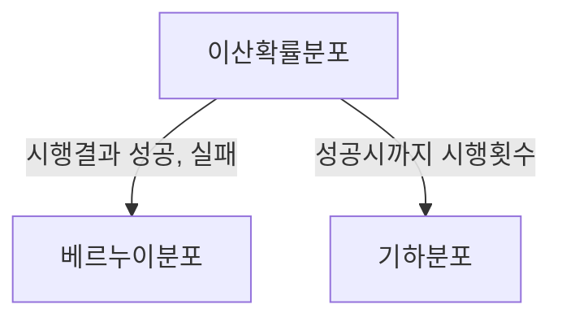

## 이산확률분포 개념

- 확률변수가 가지는 값이 명확히 구분되는 경우의 확률분포

## 베르누이 분포와 기하 분포 개념 비교

| 베르누이 분포 | 기하 분포 |
| --- | --- |
| 상호 배반인 두가지 가능한 결과 중 하나를 가지는 베르누이 시행을 나타내는 확률 분포 | 독립적인 베르누이 시행을 여러번 수행할 때 처음 성공까지 시도한 횟수의 분포 |

## 베르누이 분포와 기하분포 상세 비교

| 구분 | 베르누이 분포 | 기하 분포 |
| --- | --- | --- |
| 수식 | 성공확률 P, 실패확률 1-P | 예상치 $$ E(X) = 1/P $$ |
| - | 평균 $$ E(X) = P $$ | 분산 $$ Var(X) = \frac{1-p}{p^2} $$ |
| - | 분산 $$ Var(X) = p(1 - p) = pq $$ | - |
| 사례 | 동전 뒤집기 | 타율이 3할인 선수가 두번째 타석에서 홈런칠 확률 |

## 베르누이 분포와 기하분포 사용

- 확률 모델링과 추론에 사용
- 빅데이터 분석의 확률 통계, 정보 이론 등에 사용
