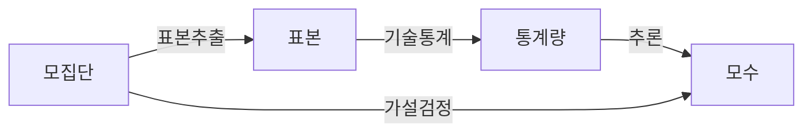
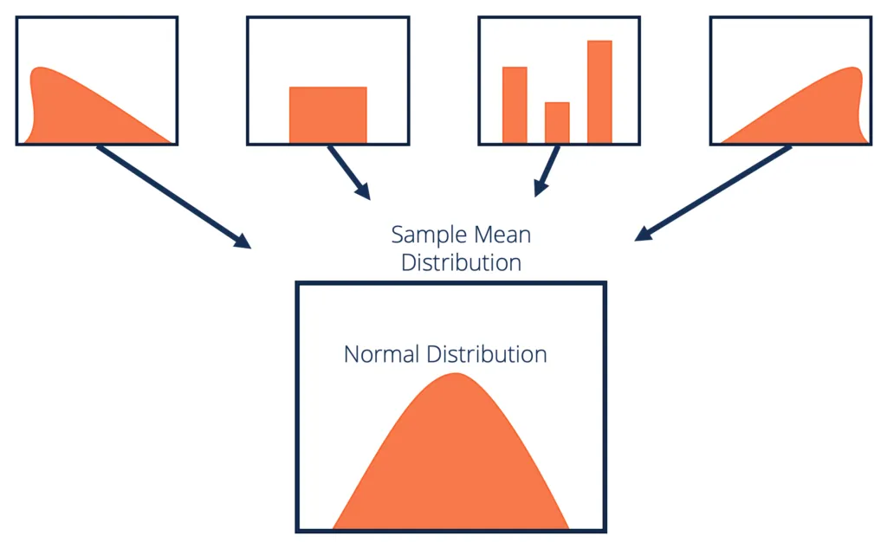
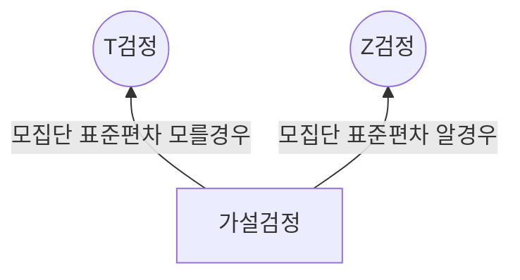

## 추론통계 개념

- 샘플데이터를 기반으로 모집단의 특성을 추론하거나 가설을 검증하는 통계방법
- 표본추출
  - 랜덤추출
  - 계통추출
  - 집락추출
  - 층화추출
- 기술통계
  - 평균
  - 분산
  - 표준편차
- 추론
  - 점추정
  - 구간추정
- 가설검정
  - 모수검정
  - 비모수검정

## 중심극한정리 개념 및 특징

### 중심극한정리 개념도

- 모집단으로부터 추출된 표본의 크기가 충분히 커지면 모집단 표본 분포와 상관없이 표본들의 평균분포가 표준정규분포를 따른다는 법칙
- [이미지출처](https://corporatefinanceinstitute.com/resources/data-science/central-limit-theorem/)

### 중심극한정리 특징

| 구분 | 특징 | 내용 |
| --- | --- | --- |
| 통계적 추론 | 정규분포 근사화 | 표본 평균을 정규분포에 근사화하여 통계적 추론을 간편하게 만들어줌 |
| - | 추론 강화 | 적은 표본에도 모집단 추론 가능 |
| 표본과 모집단 | 표본 크기 영향 | 표본 크기 중에서 중심극한정리 적용 용이 |
| - | 모집단 분포 독립ㅈ거 | 모집단 데이터 분포에 상관없이 평균분포 근사값 제공 |

- 모집단의 분포가 정규분포가 아니여도 중심극한정리에 의해 정규분포로 가정 후 통계분석 가능

## T검정, Z검정 비교

### T검정, Z검정 관계도

### T검정, Z검정 상세비교

| 구분 | T검정 | Z검정 |
| --- | --- | --- |
| 모집단 정보 | 표준편차 모를 때 사용 | 표준편차 알 때 사용 |
| 표본 크기 | 소규모 | 대규모 |
| 유연성 | 표본 크기가 작아도 정확한 추론 | 표본 크기 작으면 부정확 |
| 분포 사용 | T분포 | Z분포 |
| 예시 | 학생성적 빅교, 소규모 실험 전/후 비교 | 공장 생산품질 비교, 대규모 설문조사 분석 |
