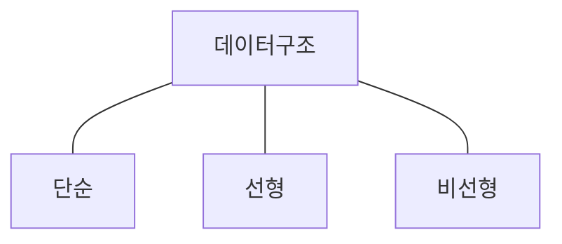

## 데이터 구조 개념

- 데이터를 효율적을 저장/관리하여 메모리를 효율적으로 사용하기 위한 방법

## 선형구조, 비선형구조 유형, 비교

### 선형 데이터 구조 유형

| 구분 | 개념도 | 내용 |
| --- | --- | --- |
| 리스트 | - | 순차적으로 저장, 큰 삽입/삭제 비용 |
| 링크드 리스트 | - | 노드를 포인터로 연결, 접근시 비효율 |
| 스택 | - | LIFO, 함수호출시 사용 |
| 큐 | - | FIFO, 프로세스 스케쥴링 사용 |
| 데크 | - | 양방향 삽입, 삭제, 유연한 데이터 처리 |

- 데이터 구성요소들을 순차 나열한 자료구조

### 비선형 데이터 구조 유형

| 구분 | 개념도 | 내용 |
| --- | --- | --- |
| 그래프 | - | 정점과 간선의 집합, 방향, 무방향 그래프 존재 |
| 트리 | - | 계층 구조의 노드 집합, 부모-자식 관계 구성 |
| 힙 | - | 완전이진트리의 일종, 부모 노드가 자식보다 크거나 작음 |

### 선형, 비선형 데이터 구조 비교

| 구분 | 선형구조 | 비선형구조 |
| --- | --- | --- |
| 데이터 탐색 | 순차접근, 탐색 | 계층접근, 네트워크접근 |
| 메모리효율 | 비효율 | 효율 |
| 구현용이성 | 쉬움 | 어려움 |
| 레벨 | 단일레벨 | 다중레벨 |
| 사례 | 스케쥴링, 버퍼 등 | SNS, NW모델링, DOM 등 |

## 데이터 구조 선택시 고려사항

- 사용하려는 자료구조의 탐색, 저장, 삭제에 따른 시간복잡도, 공간복잡도를 고려한 선택 필요
