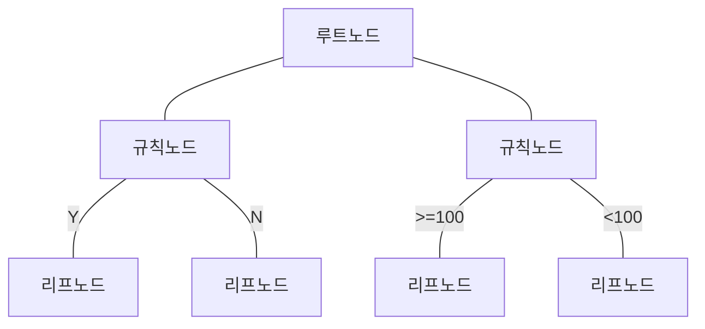

## 의사결정나무 개요

### 의사결정나무 개념

- 주어진 입력값들의 조합을 ==의사결정규칙==에 따라 ==출력값을 예측==하는 모형
- ==의사결정규칙==을 트리구조로 나타내어 ==분류와 예측==을 수행하는 분석 방법

## 의사결정나무 구성도, 구성요소, 유형

### 의사결정나무 구성도

### 의사결정나무 구성요소

| 구분 | 내용 | 비고 |
| --- | --- | --- |
| 루트노드 | 모든 데이터의 첫 속성 평가 | 첫 분기 결정 |
| 규칙노드 | 특정 속성에 대한 테스트 수행 후 데이터 분리 | 조건문 따라 하위노드 분기 |
| 리프노드 | 최종결과노드, 데이터 분류 또는 예측 | 분류 클래스 |

### 의사결정나무 유형

- 분류트리: ==범주형 변수==를 예측하기 위해 사용되는 트리 모델, 데이터를 여러 범주로 분류
- 회귀트리: ==연속형 변수==의 값을 예측하기 위한 트리모델

| 구분     | 분류트리                         | 회귀트리                        |
| -------- | -------------------------------- | ------------------------------- |
| 대상     | 범주형 변수 대상                 | 연속형 변수 대상                |
| 특징     | 불순도를 기준으로 최적 분류 결정 | 분산을 최소화하는 방향으로 분할 |
| 평가방법 | ==지니지수, 엔트로피==               | ==오차제곱합==                      |
| 사용시기 | 명확한 범주를 가진 데이터 분류   | 연속적 수치 예측, 트렌드 예측   |

## 의사결정나무 절차, 평가지표

### 의사결정나무 절차

- 성장: 분석목적에 따른 트리 생성
- 가지치기: 불필요한 가지를 제거하여 과대적합, 과소적합 방지
- 타당성 평가: 가장 적은 엔트로피를 갖는 나무를 평가하고 최적 모형 선택
- 해석 및 예측: 구축된 나무모형 해석

### 의사결정나무 평가지표

| 구분 | 지표 | 내용 |
| --- | --- | --- |
| 분류나무 | 지니계수 | 해당 구역 내 특정 클래스에 속하는 데이터 비율을 모두 제외한 값 |
| - | 엔트로피 | 데이터의 무질서도를 측정하여 정보 획득량 계산 |
| 회귀나무 | 오차제곱합 | 실제 값과 예측 값의 오차 제곱 최소화 |

- 지표가 0에 가까울 수록 잘 분류된 모델로 판별 가능

## 의사결정나무 고려사항

- Impurity를 0으로 만들기 위해 트리 깊이가 깊어질 경우 오버피팅 발생하므로, 앙상블 기법 사용 고려 필요
