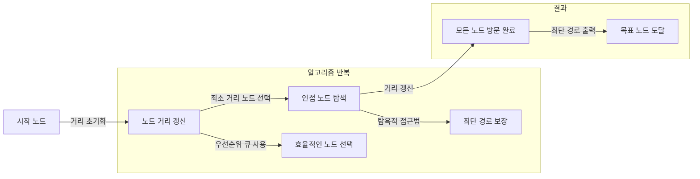

## 다익스트라 알고리즘 개념

- 가중치가 양수인 그래프에서 한 노드에서 다른 모든 노드로의 최단 경로를 찾는 알고리즘
- 탐욕 접근 기반으로 최단 경로 탐색, 네트워크 최적화, 실시간 경로 계산에 적합

## 다익스트라 알고리즘 동작원리, 수행절차, 활용사례

### 다익스트라 알고리즘 동작원리

- 우선순위 큐 사용시 $O((V+E) log V)$의 시간복잡도로 거리 탐색 가능

### 다익스트라 알고리즘 수행절차

| 구분 | 설명 | 예시 |
| --- | --- | --- |
| 초기화 | 시작 노드의 거리를 0으로 설정하고 나머지 노드의 거리를 무한대로 초기화 | 시작 노드 A: 0, 나머지 노드: $\infty$ |
| 노드 선택 | 방문하지 않은 노드 중 가장 작은 거리 값을 가진 노드 선택 | 현재 노드 A → 인접 노드 B, C |
| 거리 갱신 | 선택된 노드와 인접한 노드들의 거리 값을 갱신 | 노드 B 거리: 5, 노드 C 거리: 3 |

### 다익스트라 알고리즘 활용사례

| 활용분야 | 내용 | 사례 |
| --- | --- | --- |
| 네트워크 라우팅 | OSPF 프로토콜에서 최적의 데이터 경로 탐색 | Cisco 및 Juniper 네트워크 장비 |
| 지도 탐색 서비스 | 도로 네트워크의 가중치를 기반으로 최단 경로 제공 | Google Maps, Waze, 네이버 지도 |
| 공장 물류 자동화 | 물류 로봇 및 AGV(Automated Guided Vehicle)의 이동 경로 최적화 | Amazon 물류 창고 로봇 |

## 다익스트라 알고리즘 개선방안

| 한계점 | 설명 | 개선 방안 |
| --- | --- | --- |
| 음수 가중치 미지원 | 음수 가중치가 있는 그래프에서는 올바른 결과를 보장하지 못함 | 벨만-포드 알고리즘 활용 |
| 대규모 그래프에서 성능 저하 | 많은 노드와 간선을 포함하는 그래프에서 높은 계산 비용 발생 | 휴리스틱 기반 A\* 알고리즘 적용 |
| 복잡한 환경 | 동적인 환경에서 즉각적인 경로 변경 어려움 | AI 기반 실시간 경로 재계산 기술 도입 |
