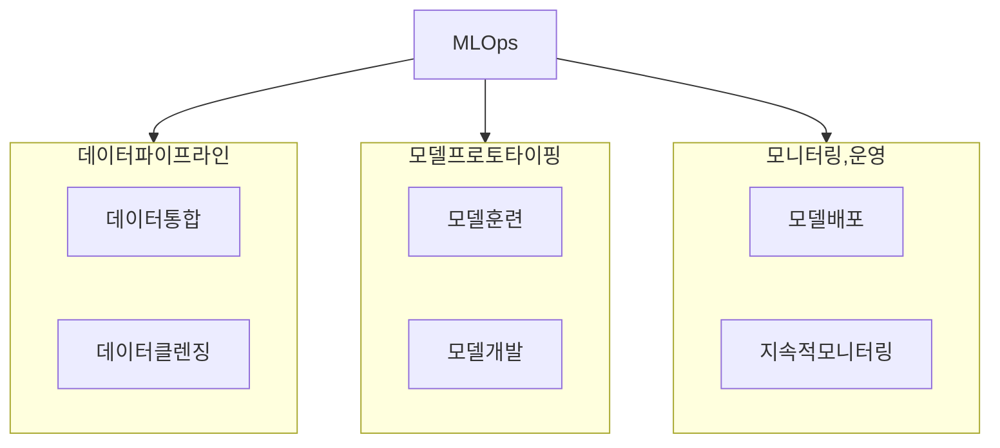

## DSML 개념

- 데이터 사이언스와 머신러닝을 활용하여 데이터에서 가치를 창출하고 예측모델을 구축하는 프로젝트
- 복잡한 워크플로우, 협업의 어려움, 모델 배포의 어려움, 모델 신뢰성과 지속가능성 문제
- 효율적인 모델관리, 지속적 통합 배포, 모델 모니터링, 유지보수, 향상된 협업을 위해 MLOps

## MLOps 개념도, 구성요소, 적용방안

### MLOps 개념도

### MLOps 구성요소

| 구분 | 내용 | 비고 |
| --- | --- | --- |
| 자동화 파이프라인 | 데이터준비, 모델훈련/배포과정 자동화로 효율성 증대 | 개발 및 운영 프로세스 |
| 버전 관리 | 모델 리뷰, 변경 관리, 롤백 절차 수립 | VCS 사용 |
| 플랫폼 엔지니어링 | 데이터사이언티스트, 엔지니어, 이해관계자 협업 플랫폼 제공 | 모델 거버넌스 확립 |

### MLOps 성숙단계

| 레벨 | 단계 | 내용 |
| --- | --- | --- |
| 2 | 최적화 | ML 파이프라인 오케스트레이션, 모델 추적 관리 |
| 1 | 통합 | ML 파이프라인 자동화, 지속적 모델 훈련 |
| 0 | 도입 | 수동 워크플로우로 데이터 사이언티스트와 엔지니어가 별도 작업 |

## MLOps 고려사항

- ISO25029 AI품질속성에 따라 모델의 품질 검증 절차 자동화 필요
