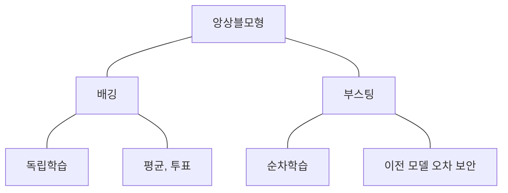
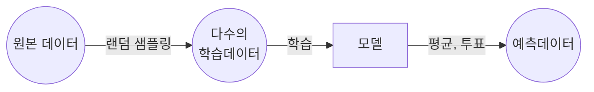
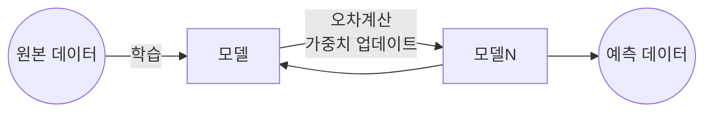

## 앙상블 모델의 개념

- 여러 개별 모델을 결합하여 하나의 강력한 예측 모델을 만드는 기법
- 배깅은 독립적으로 학습시킨 모델의 결과를 취합하고, 부스팅은 순차학습시켜 이전 모델의 오차를 보완하는 기법

## 배깅, 부스팅의 구성도, 구성요소

### 배깅의 구성도, 구성요소, 비교

- 다수 모델을 학습시켜 예측 결과 도출

| 구분 | 내용 | 비고 |
| --- | --- | --- |
| 랜덤 샘플링 | 원본 데이터셋을 복원 추출 | 개별 모델 다양성 확보, 과적합 방지 |
| 병렬모델학습 | 각 모델을 독립적으로 학습 수행 | 랜덤 포레스트 등 결정 트리 기반 |
| 예측 결합 | 각 예측 데이터를 합산하여 결과 도출 | 평균, 투표 |

### 부스팅의 구성도, 구성요소

- 모델을 순차적으로 학습, 가중치 반영하여 예측 결과 도출

| 구분 | 내용 | 비고 |
| --- | --- | --- |
| 순차모델 학습 | 이전 모델의 오차를 보완하여 학습 | 오차 감소 |
| 가중치 업데이트 | 오차가 큰 데이터에 높은 가중치 부여 | 오답 집중 학습 |
| 반복 학습 | 가중치 반영 모델 반복 학습 | 순차 실행 |
| 예측 결합 | 모든 모델 예측에 가중치 반영한 평균 계산 | 그라디언트 부스팅 |

### 배깅, 부스팅 비교

| 구분 | 배깅 | 부스팅 |
| --- | --- | --- |
| 목표 | 분산 감소, 과적합 방지 | 편향 감소 |
| 계산 비용 | 빠름, 병렬 | 느림, 순차 |
| 결합 방식 | 평균, 투표 | 가중 평균 |

- 데이터 분산, 편향을 참조하여 앙상블 기법 선택
