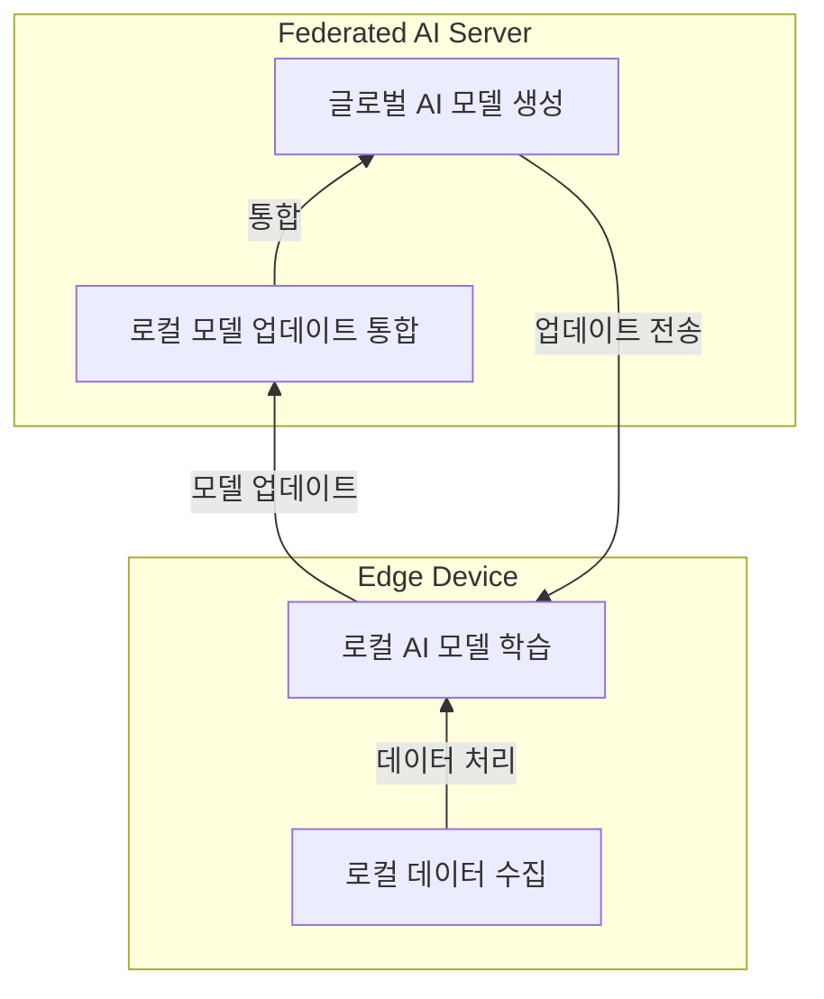

## 연합학습 개념

- 데이터를 중앙 저장하지 않고 다수의 로컬 디바이스에서 모델 훈련 후, 훈련된 모델 파라미터를 중앙서버로 전송해 모델을 업데이트하는 분산 인공지능 학습모델
- 데이터 프라이버시, 보안, 통신비용 절감, 확장성, 속도

| 필요성 | 설명 | 사례 |
| --- | --- | --- |
| 데이터 프라이버시 보호 | 민감한 데이터가 중앙 서버로 이동하지 않아 보안 강화 | 헬스케어에서 환자 데이터 보호 |
| 네트워크 부하 감소 | 대량 데이터 전송 없이 로컬에서 처리하여 트래픽 절감 | 자율주행 차량 간 통신 부하 경감 |
| 실시간 데이터 처리 | 로컬 디바이스에서 즉각적으로 데이터 분석 및 의사 결정 | 스마트 시티의 실시간 교통 관리 |
| 분산 학습 가능 | 다양한 지역에서 수집된 데이터를 활용해 AI 모델 학습 | 산업 IoT에서 분산된 공장 데이터 활용 |

## 연합학습 구성도, 핵심요소, 주요 기법

### 연합학습 구성도

### 연합학습 핵심요소

| 구분 | 설명 | 주요 기술 |
| --- | --- | --- |
| 엣지 디바이스 | 데이터 수집 및 로컬 학습 수행 | IoT 디바이스, 스마트폰, 차량 센서 |
| 연합 학습 | 모델 업데이트만 공유하여 프라이버시 보호 | Federated Averaging, Differential Privacy |
| 통신 프로토콜 | 중앙 서버와 엣지 디바이스 간 안전한 데이터 전송 및 동기화 | gRPC, MQTT |
| 모델 집계 서버 | 각 엣지에서 전송된 모델 업데이트를 통합하여 최적화된 모델 생성 | 클라우드 서버, AI 오케스트레이션 시스템 |
| 보안 및 인증 기술 | 데이터 보호 및 무결성 검증 | 블록체인, 데이터 암호화, Zero Trust Security |

### 연합학습 주요 기법

| 구분 | 내용 | 비고 |
| --- | --- | --- |
| FedSGD | 모든 로컬 디바이스에서 계산된 그라디언트를 중앙에서 평균화하여 모델 업데이트 | 데이터 이질성 취약 |
| FedAVG | 로컬에서 여러 배치 업데이트를 수행 후 결과를 중앙 서버로 전송 | 통신 비용 절감 |
| FedDyn | 이질적 데이터셋에서 로컬 손실함수에 동적으로 정규화 적용, 글로벌 손실 수렴처리 | 데이터 이질성에 강건함 |
| HyFDCA | 하이브리드 연합학습으로 클라이언트 다양성을 고려한 모델의 조정과 개인화 | 적응적 개인화 가능 |

## 연합학습 보안 강화 기법, 활용 방안

### 연합학습 보안

| 구분 | 내용 | 비고 |
| --- | --- | --- |
| 데이터 암호화 | 모델 업데이트 정보 암호화 | 전송구간 보호 |
| 차등프라이버시 | 모델 업데이트시 노이즈 추가, 개인 데이터 노출 방지 | 프라이버시 강화 |
| 인증, 접근제어 | 로컬장치-서버 간 신뢰할 수 있는 통신 보장 | 무단 접근 차단, HMAC, OAuth |
| 안전한 집계 | 값 노출 없이 중앙서버에서 각 장치의 업데이트 처리 | 중간자 공격 방어 |

### 연합학습 활용 방안

| 분야 | 활용 방안 | 사례 |
| --- | --- | --- |
| 스마트 시티 | 엣지 디바이스에서 교통 및 공공 데이터 실시간 분석 | 바르셀로나 스마트 시티 프로젝트 |
| 헬스케어 | 환자의 의료 데이터를 보호하며 AI 기반 진단 지원 | Google의 Federated Learning 웨어러블 기기 활용 |
| 산업 IoT(IIoT) | 제조 공정 데이터를 분석해 생산성 향상 및 고장 예측 | Siemens의 예측 유지보수 시스템 |
| 자율주행 | 지역별 주행 데이터를 활용해 AI 기반 자율주행 최적화 | Tesla의 자율주행 AI |

## 연합학습 고려사항

| 고려사항 | 설명 | 해결 방안 |
| --- | --- | --- |
| 데이터 동기화 문제 | 분산된 디바이스 간 데이터 학습 결과를 일관되게 유지해야 함 | 클라우드-엣지 협력 강화 및 최적화된 통신 프로토콜 적용 |
| 컴퓨팅 자원 제한 | 엣지 디바이스의 연산 능력이 제한적임 | 경량화된 AI 모델 사용(MicroNet) 및 하드웨어 가속기 활용 |
| 보안 및 신뢰성 | 데이터 도난 및 변조 위험이 존재 | 블록체인 기반 데이터 무결성 보장 및 강화된 인증 시스템 적용 |
| 표준화 부족 | Federated AI 및 엣지 컴퓨팅 간의 상호운용성이 낮음 | IEEE, ISO 등 글로벌 표준 개발 및 채택 추진 |
