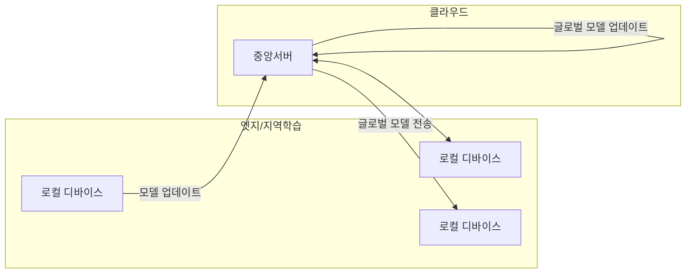

## 연합학습 개념

- 데이터를 중앙 저장하지 않고 다수의 로컬 디바이스에서 모델 훈련 후, 훈련된 모델 파라미터를 중앙서버로 전송해 모델을 업데이트하는 분산 인공지능 학습모델
- 데이터 프라이버시, 보안, 통신비용 절감, 확장성, 속도

## 연합학습 구성도, 주요 기법, 보안

### 연합학습 구성도

### 연합학습 주요 기법

| 구분 | 내용 | 비고 |
| --- | --- | --- |
| FedSGD | 모든 로컬 디바이스에서 계산된 그라디언트를 중앙에서 평균화하여 모델 업데이트 | 데이터 이질성 취약 |
| FedAVG | 로컬에서 여러 배치 업데이트를 수행 후 결과를 중앙 서버로 전송 | 통신 비용 절감 |
| FedDyn | 이질적 데이터셋에서 로컬 손실함수에 동적으로 정규화 적용, 글로벌 손실 수렴처리 | 데이터 이질성에 강건함 |
| HyFDCA | 하이브리드 연합학습으로 클라이언트 다양성을 고려한 모델의 조정과 개인화 | 적응적 개인화 가능 |

### 연합학습 보안

| 구분 | 내용 | 비고 |
| --- | --- | --- |
| 데이터 암호화 |  모델 업데이트 정보 암호화 | 전송구간 보호 |
| 차등프라이버시 | 모델 업데이트시 노이즈 추가, 개인 데이터 노출 방지 | 프라이버시 강화 |
| 인증, 접근제어 | 로컬장치-서버 간 신뢰할 수 있는 통신 보장 | 무단 접근 차단, HMAC, OAuth |
| 안전한 집계 | 값 노출 없이 중앙서버에서 각 장치의 업데이트 처리 | 중간자 공격 방어 |

## 연합학습 고려사항

- 다양한 하드웨어와 네트워크 조건에서 일관된 성능을 보장할 수 있도록 흐름제어, 오류제어 필요
