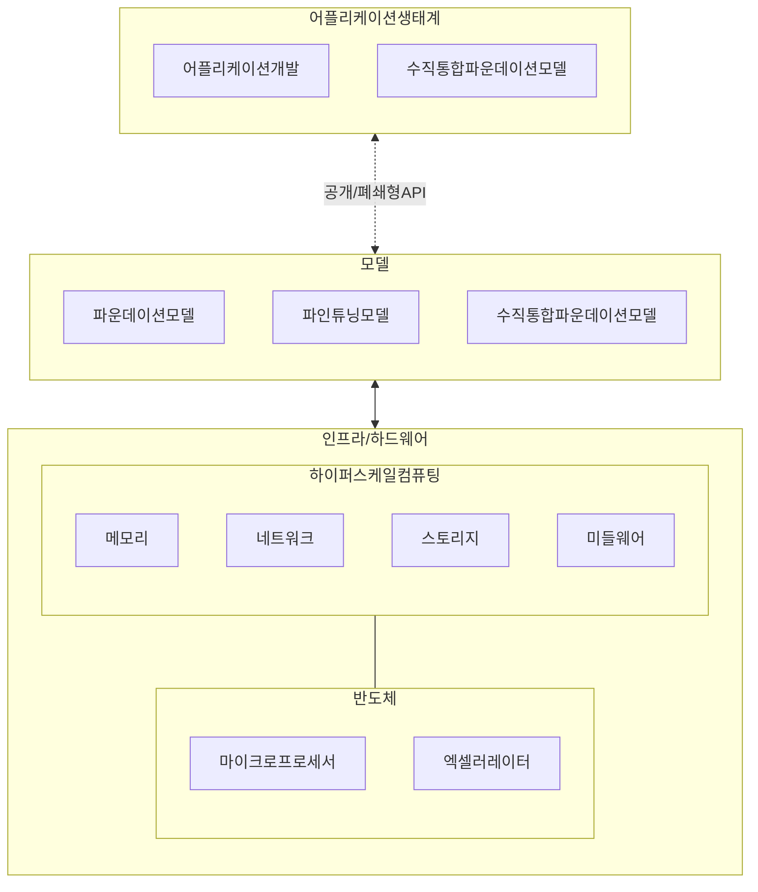

## 생성형 AI 개념

- 인간의 창의성을 모방하여 새로운 콘텐츠를 자동으로 생성하는 혁신적 기술
- 파운데이션 모델로 전반적 AI 제공, 모델 사전 훈련 통한 학흡 능력 향상, 다양한 문제 해결 능력, 애플리케이션 개발 용이성, 속도 향상

## 생성형 AI 기술스택, 비지니스 모델, 한계점

### 생성형 AI 기술스택

- 생성형 인공지능 모델을 활용하여 최종 사용자를 위한 기능과 서비스 구현

### 생성형 AI 비지니스 모델

| 구분 | 내용 | 비고 |
|---|---|---|
| API 플랫폼 제공 | 고성능 AI 챗봇 API를 개발자에게 제공하여 다양한 서비스 개발을 지원 | ChatGPT API |
| 맞춤형 AI 솔루션 구축 | 기업 요구에 맞는 맞춤형 생성형 AI 솔루션 개발 | TabNine |
| 콘텐츠 제작 및 큐레이션 | 텍스트, 이미지, 음악 등 콘텐츠를 생성하고 이를 큐레이션하여 제공| DeepAI, Luminovo |
| 데이터 레이블링 및 정제 | AI 학습용 데이터를 레이블링하고 정제하는 서비스 제공| SageMaker |
| AI 기반 교육 및 컨설팅 | AI 기술을 효과적으로 적용하기 위한 교육 및 컨설팅 서비스 제공| AI디지털교과서 |

### 생성형 AI 한계점

| 구분 | 내용 | 대응 방안 |
| --- | --- | --- |
| 기술적 한계 | 할루시네이션 (잘못된 정보 제공) | 데이터 검증 강화, 품질 높은 학습 데이터 사용 |
| | 방대한 컴퓨팅 자원과 높은 비용 요구 | 효율적인 모델 설계, 비용 절감 기술 개발 |
| | 심각한 에너지 소비와 온실가스 배출 | 친환경 AI 기술 개발, 에너지 최적화 노력 |
| 윤리/사회적 한계 | 가짜뉴스, 딥페이크, 저작권 침해 | 윤리 가이드라인 수립, 법적 규제 강화 |
| | 일자리 감소와 노동시장 변화 가속화 | 재교육 프로그램 도입, 새로운 일자리 창출 정책 개발 |

## 생성형 AI 비지니스 고려사항

| 구분 | 내용 | 비고 |
| --- | --- | --- |
| 정부 | 윤리적 가이드라인 마련 및 법적 규제 강화 | 가짜뉴스 및 저작권 문제 예방 |
| | 기술 연구개발 지원 및 인재 양성 프로그램 추진 | 친환경 AI 기술 개발 지원 |
| | 국제 협력을 통한 AI 정책 조율 | 글로벌 표준화 노력 |
| 기업 | 혁신적인 비즈니스 모델 구축 | 기존 서비스 개선, 신규 사업 기회 창출 |
| | AI 기술 활용을 위한 조직 혁신 | 변화하는 시장에 적응 |
| | 지속 가능성을 위한 기술 투자 | 에너지 효율 및 비용 절감 기술 개발 |
| 개인 | AI 기술 활용 능력과 창의적 문제 해결 역량 강화 | 재교육 및 학습 기회 활용 |
| | 윤리적 AI 사용에 대한 인식 제고 | 정보 검증 능력 배양 |
| | 사회 변화에 능동적 대응 | 변화에 적응할 준비 |

## 참조

- [IITP: 주간기술동향 2145호](https://iitp.kr/kr/1/knowledge/periodicalViewA.it?searClassCode=B_ITA_01&masterCode=publication&identifier=1330)
