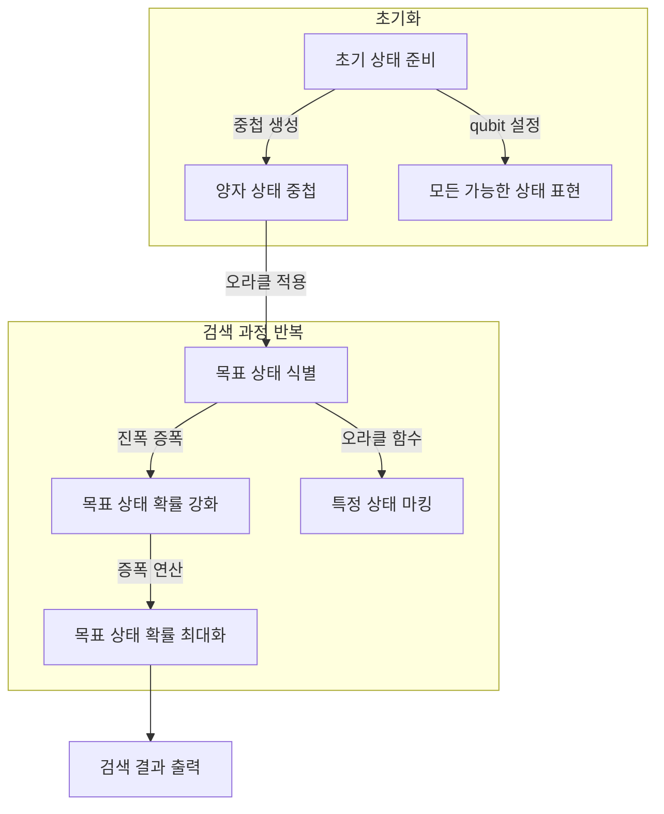

## Grover 알고리즘 개념

- ==양자 중첩과 확률 진폭 증폭을 활용==하여 비구조적 데이터베이스에서 특정 항목을 검색하는 데 사용되는 검색 알고리즘
- $O(\sqrt{N})$ 로 검색속도 향상 / 암호화된 키 공간 효율적 탐색 / 양자 병렬성 활용 고전 검색 알고리즘 한계 극복

## Grover 알고리즘 동작 매커니즘, 동작 원리

### Grover 알고리즘 동작 매커니즘

### Grover 알고리즘 동작 원리

| 단계 | 설명 | 예시 |
| --- | --- | --- |
| 양자 상태 중첩 | 모든 가능한 상태를 동시에 표현 | N개의 데이터 → $2^n$개의 상태 |
| 양자 오라클 | 목표 데이터를 식별하는 함수 | 특정 항목에 해당하는 상태 마킹 |
| 진폭 증폭 | 목표 상태의 확률 진폭을 강화 | 검색 성공 확률 증가 |

## Grover 알고리즘 효율성 비교, 적용 사례

### Grover 알고리즘 효율성 비교

| 특징 | 고전적 검색 알고리즘 | Grover 알고리즘 |
| --- | --- | --- |
| 시간 복잡도 | $O(N)$ | $O(\sqrt{N})$ |
| 병렬 처리 | 불가능 | 가능 |
| 대규모 데이터 처리 | 비효율적 | 효율적 |
| 암호학적 응용 | 느림 | 빠름 (예: AES 키 공간 검색) |

### Grover 알고리즘 적용 사례

| 적용 분야 | 활용 사례 | 기대 효과 |
| --- | --- | --- |
| 대규모 데이터 검색 | 비정형 데이터베이스에서 특정 값 검색 | 검색 속도 획기적 향상 |
| 암호 해독 | AES 및 대칭키 암호에서 키 검색 속도 단축 | 기존 보안 체계의 취약점 발생 가능 |
| 최적화 문제 해결 | 금융, 물류, 헬스케어 등에서 최적 경로 탐색 | 계산 속도 향상 및 비용 절감 |

## Grover 알고리즘 고려사항

| 한계점 | 설명 | 해결 방안 |
| --- | --- | --- |
| 실제 하드웨어 제약 | 현재 양자컴퓨터의 에러율과 결어긋남 문제 | 양자 오류 정정 기술 발전 필요 |
| 데이터 구조 고려 부족 | 구조화된 데이터 검색에는 비효율적 | 특정 문제에 맞는 최적화 필요 |
| 양자컴퓨터의 상용화 지연 | 실용화된 양자 하드웨어가 부족 | 클라우드 기반 양자컴퓨팅 서비스 활용 |
