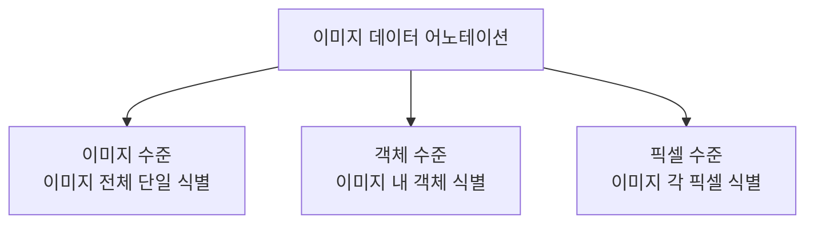

## 이미지 데이터 어노테이션 개념

- 인공지능 모델을 학습시키기 위해 이미지 데이터에 레이블을 붙이는 과정
- 이미지 수준, 객체 수준, 픽셀 수준으로 추가 정보 부여

## 이미지 데이터 어노테이션의 유형과 기법

### 이미지 데이터 어노테이션의 유형

- 픽셀 수준으로 갈수록 높은 정밀도, 어노테이션 비용 증가
- 이미지 데이터 활용 목적과 수준 및 범위에 따라 적절한 수준의 어노테이션 유형 선택

### 이미지 데이터 어노테이션의 기법

| 유형 | 기법 | 설명 |
| --- | --- | --- |
| 이미지 수준 | 이미지 분류 | 이미지 파일 단순 분류 |
| 객체 수준 | 바운딩 박스 | 객체의 최소 사각형으로 분류 |
| | 폴리곤 | 객체의 윤곽을 따라 다각형으로 어노테이션 |
| | 키포인트 | 객체의 주요 특징점 어노테이션 |
| | 3D 큐보이드 | 객체를 3차원 박스로 식별하여 위치 및 크기 판별 |
| 픽셀 수준 | 시맨틱 세그멘테이션 | 이미지 각 픽셀별 클래스 지정 |
| | 인스턴스 세그멘테이션 | 클래스 내에서 개별 객체를 구분해 픽셀 레이블 지정 |
