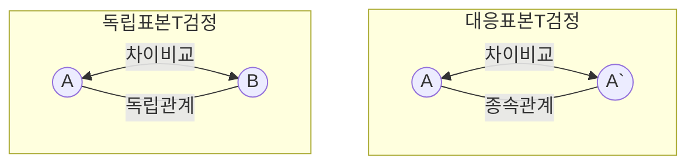

## T검정 개념

- 두 집단 이하의 평균을 비교하여 차이가 있는지 검증하는 통계적 방법으로 독립표본 T검정과 대응표본 T검정으로 구분

## 독립표본 T검정, 대응표본 T검정 비교, 적용사례

### 독립표본 T검정, 대응표본 T검정 비교

| 구분 | 독립표본 T검정 | 대응표본 T검정 |
| --- | --- | --- |
| 개념 | 두 독립된 집단의 평균 비교 | 동일한 집단의 두 시점 비교 |
| 표본 | 독립적인 두 집단 | 동일한 집단 반복 |
| 가정 | 두 그룹 모집단이 정규분포를 따르고, 분산은 동일 | 두 시점 간 차이가 정규분포를 따름 |
| 검정통계량 | 두 그룹의 평균차이를 표준오차로 나눠 T값 계산 | 두 시점의 차이를 표준 오차로 나눠 T값 계산 |
| 자유도 | `n1 + n2 - 2` | `n - 1` |

### 독립표본 T검정, 대응표본 T검정 적용사례

| 구분 | 기법 | 사례 |
| --- | --- | --- |
| 두 개의 독립된 집단 비교 | 독립표본 T검정 | 남, 여 평균 체지방 비교 |
| 동일 집단의 두 시점 비교 | 대응표본 T검정 | 같은 학생의 기말고사 전/후 성적 비교 |
| 같은 집단의 두 조건 비교 | 대응표본 T검정 | 동일 환자의 약물치료 전/후 체중 비교 |

## T검정시 고려사항

- 세 개 이상의 독립된 집단 간의 평균 비교시 ANOVA 기법 활용
