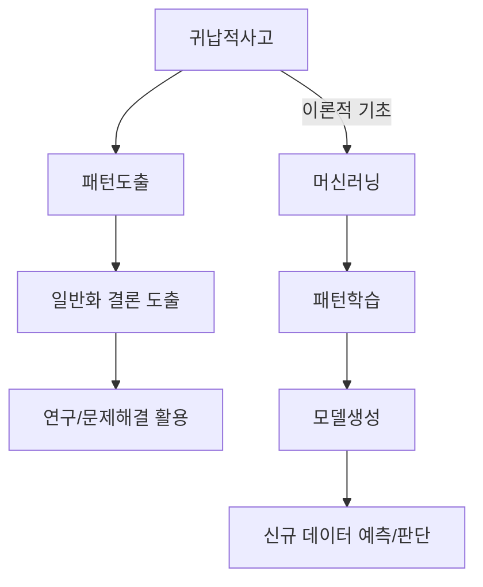

## 귀납적 사고 개념

- 특정한 사례나 데이터에서 패턴을 발견하고 일반적인 결론이나 규칙을 도출하는 사고방식
- 데이터 기반 의사결정, 예측 가능성, 지식 확장

## 귀납적 사고와 머신러닝 관계도, 유형, 활용방안

### 귀납적 사고와 머신러닝 관계도

### 귀납적 머신러닝 유형

| 구분 | 내용 | 비고 |
| --- | --- | --- |
| 지도학습 | 라벨링된 데이터로 모델학습, 새로운 데이터 예측 수행 | 분류, 회귀 등 |
| 비지도학습 | 라벨링 없는 데이터로 구조나 새로운 패턴 발견 | 군집화, 차원 축소 등 |
| 강화학습 | 에이전트가 환경과 상호작용하여 보상을 통해 학습 | 게임, 로봇공학 등 |

### 머신러닝 활용방안

| 구분 | 활용방안 | 비고 |
| --- | --- | --- |
| 이미지 인식 | 이미지에서 객체, 인물 인식 기술 | 얼굴 인식, 의료 영상 인식 |
| 자연어 처리 | 텍스트 데이터 분석, 의미 이해/처리 | 번역, 챗봇, 감정 분석 |
| 추천 시스템 | 사용자 데이터 분석, 개인화 서비스 | 상품 추천, 콘텐츠 추천 |

## 머신러닝 고려사항

- 안전하고 지속가능한 AI 생태계를 위해 AI 거버넌스 확립 필요
