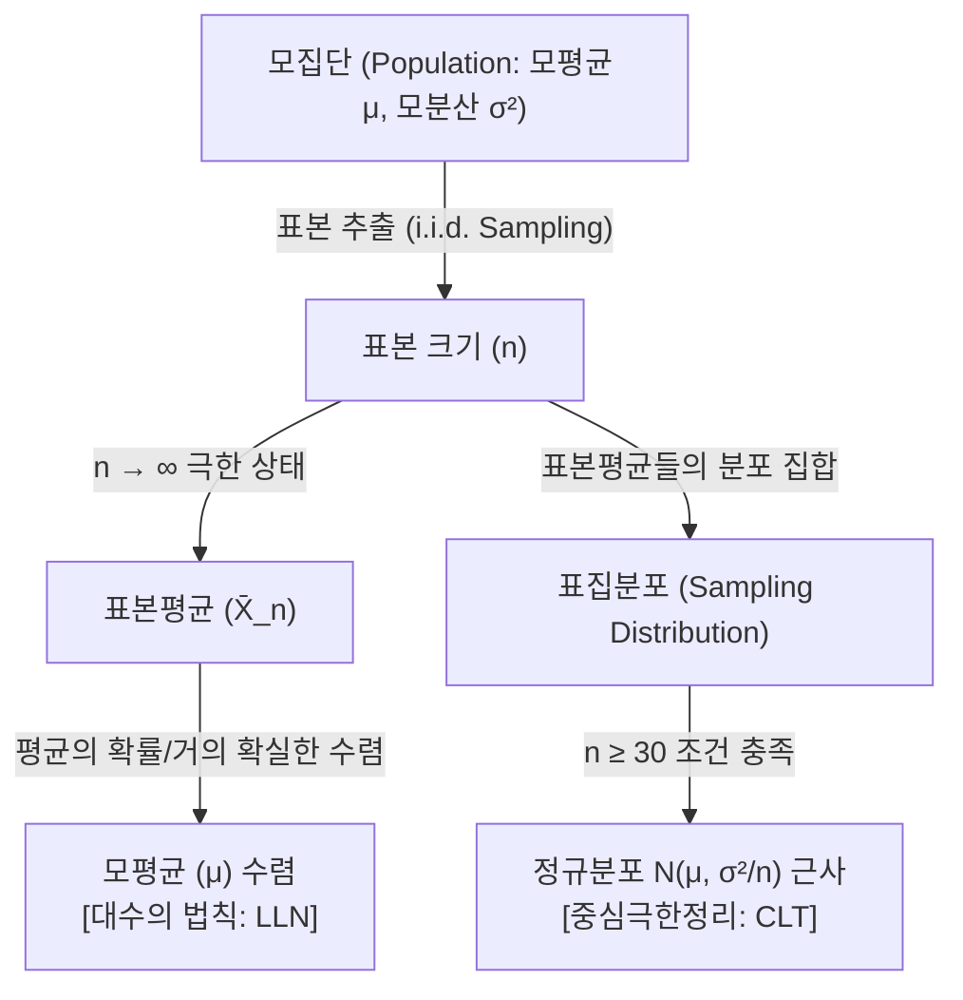

## 대수의 법칙과 중심극한정리의 개요

### 대수의 법칙과 중심극한정리의 개념

- **대수의 법칙 (LLN):** 표본의 크기 $n$이 커짐에 따라 ==표본평균이 모평균(기댓값)에 확률수렴 또는 거의 확실하게 수렴==함을 밝히는 기초 정리.
- **중심극한정리 (CLT):** 모집단의 원래 분포 형태와 무관하게 표본의 크기 $n$이 충분히 크면 ==표본평균들의 집합 분포가 정규분포에 근사(분포수렴)==함을 규명하는 정리.

### 대수의 법칙과 중심극한정리의 시사점

- **표본추출 통계의 타당성 확보:** 모집단 전수조사가 불가능한 상황에서 부분 표본(Sampling) 분석만으로 전체 집단의 참값(모수)을 정밀하게 추론할 수 있는 과학적 기초를 제공함.
- **AI 및 기계학습 모델의 설계 근거:** 미니배치 경사하강법(SGD)의 그래디언트 추정 안정성 확보, 생성형 모델(Generative Models)의 노이즈 가우시안 수렴성 설계, 몬테카를로 시뮬레이션의 차원 최적화 등에 핵심 구동 메커니즘으로 작용함.

## 대수의 법칙과 중심극한정리의 구조 및 메커니즘

### 대수의 법칙과 중심극한정리의 개념 구조도

### 대수의 법칙과 중심극한정리의 핵심 수식

#### 1. 약한 대수의 법칙 (WLLN: Weak Law of Large Numbers)
- 표본평균이 모평균에 **확률 수렴**함을 나타내며, 임의의 양수 $\epsilon$에 대해 표본 크기 $n$이 무한대로 갈 때 오차가 발생할 확률이 0이 됨을 증명함.
$$\lim_{n \to \infty} P(|\bar{X}_n - \mu| < \epsilon) = 1$$

#### 2. 강한 대수의 법칙 (SLLN: Strong Law of Large Numbers)
- 표본평균이 모평균에 **거의 확실하게(Almost Surely) 수렴**함을 의미하며, 확률적으로 1의 확신을 가지고 완벽하게 일치하게 됨을 뜻함.
$$P\left( \lim_{n \to \infty} \bar{X}_n = \mu \right) = 1$$

#### 3. 린데베르그-레비 중심극한정리 (Lindeberg-Lévy CLT)
- 독립항등분포(i.i.d.) 가정을 따르는 확률변수의 표준화된 표본평균이 표본 크기 $n$이 무한해짐에 따라 표준정규분포로 **분포 수렴**함을 규명함.
$$\frac{\sqrt{n}(\bar{X}_n - \mu)}{\sigma} \xrightarrow{d} N(0, 1)$$

#### 4. 표본평균의 정규 근사성
- 모집단의 평균이 $\mu$, 분산이 $\sigma^2$일 때, 표본 크기 $n$이 충분히 크면($n \ge 30$) 표본평균의 분포는 정규분포에 근사함.
$$\bar{X}_n \sim N\left(\mu, \frac{\sigma^2}{n}\right)$$

### 대수의 법칙과 중심극한정리의 핵심요소

| 구분 | 핵심요소 | 설명 | 비고 |
| --- | --- | --- | --- |
| **대수의 법칙 (LLN)** | 확률 수렴 (Convergence in Probability) | 표본 수가 많아질수록 표본평균이 모평균에 가까워질 확률이 1에 가깝게 누적됨 | 약한 대수의 법칙 (WLLN) |
| | 거의 확실한 수렴 (Almost Sure Convergence) | 표본평균 수열이 모평균 지점으로 수렴하는 사건의 확률 자체가 1이 됨 | 강한 대수의 법칙 (SLLN) |
| **중심극한정리 (CLT)** | 분포 수렴 (Convergence in Distribution) | 표본 평균을 표준화한 통계량의 누적분포함수가 표준정규분포에 근사적으로 일치함 | 린데베르그-레비 정리 |
| | 표본평균의 정규 근사 | 모집단의 고유 분포와 무관하게 표본평균 분포가 정규성을 획득하는 성질 | Z-검정 및 T-검정 근거 |

## 대수의 법칙과 중심극한정리의 비교 및 적용 방안

### 대수의 법칙(LLN)과 중심극한정리(CLT)의 상세 비교

| 구분 | 대수의 법칙 (LLN) | 중심극한정리 (CLT) |
| --- | --- | --- |
| **관점 및 지향점** | 표본평균이 **어디로(수렴값)** 수렴하는가? | 표본평균이 **어떤 형태(분포)**를 이루는가? |
| **수학적 수렴 종류** | 확률 수렴 ($\xrightarrow{P}$) 및 거의 확실한 수렴 ($\xrightarrow{a.s.}$) | 분포 수렴 ($\xrightarrow{d}$) |
| **전제 및 조건** | 모평균 $\mu$가 유한하게 존재함 (기댓값 존재) | 모평균 $\mu$ 및 모분산 $\sigma^2$이 유한하게 존재함 |
| **수학적 결과물** | 하나의 상수값(모평균 $\mu$)으로 수렴 | 특정 확률분포(정규분포 $N(\mu, \sigma^2/n)$)로 근사 |
| **주요 활용 분야** | 몬테카를로 적분, 매개변수 추정의 일치성(Consistency) 증명 | 표본 검정(Z-test, T-test), 신뢰구간 추정, 오차 한계 산정 |

> **기술적 시사점:** 대수의 법칙은 빅데이터 분석에서 표본 크기가 커질수록 표본 통계량이 모수에 완벽하게 정렬되는 **'대표성'**을 보장하며, 중심극한정리는 모집단의 미지 상태에서도 정규분포를 가정하여 실무적 **'가설검정 및 추론'**을 가능케 하는 상호 유기적 관계임.

### 실무 적용 및 비즈니스 활성화 방안

| 구분 | 내용 | 비고 |
| --- | --- | --- |
| **공공 분야** | 대규모 국가 센서스 및 보건 정책 표본 조사 설계 시, 최적의 통계적 정밀도 충족을 위한 표본 크기($n$) 결정에 수식 활용 | 국가통계 신뢰성 확보 |
| **금융 분야** | 몬테카를로 시뮬레이션 기반 위험가치(VaR) 산정 및 주가 지수 움직임 모의 실험 시 자산 분포 안정성 확보 | 리스크 제어 및 관리 |
| **민간/AI 분야** | 딥러닝 모델 미니배치(Mini-batch) 구성 시 배치 크기가 충분하면 매 스텝의 그래디언트 오차가 정규분포를 따르므로 가파른 수렴 유도 | MLOps 파이프라인 최적화 |

## 대수의 법칙과 중심극한정리 도입 시 실무적 고려사항

### 단계별 장애 요인 및 극복 방안

| 구분 | 문제점 | 해결방안 |
| --- | --- | --- |
| **i.i.d. 가정의 위배** | 시계열 데이터(주가, 서버 트래픽 등)나 공간 데이터는 데이터 간 종속성(Dependency)과 이질성(Heterogeneity)이 존재함 | 체계적 샘플링(Systematic Sampling) 기법을 고도화하고, 시계열 데이터는 차분(Differencing) 및 변환을 통해 정상성(Stationarity)을 확보한 후 적용 |
| **헤비 테일(Heavy-tailed) 분포** | 금융 극단 재해, 사이버 위기 트래픽 등 극단적 아웃라이어가 잦은 분포(Cauchy, Pareto 등)는 분산이 무한해 수렴이 불가능함 | 이상치 영향도가 제거된 절단 표본평균(Trimmed Mean), 분위수 회귀 분석(Quantile Regression) 등의 견고한(Robust) 비모수 검정 기법 병행 |
| **소표본($n < 30$) 환경** | 스타트업 초기 서비스나 희귀 질병 분석과 같이 샘플 수집의 물리적 한계로 표본 정밀도가 성립하지 않는 경우 | 정규성 검정(Shapiro-Wilk)을 필수 선행하고, 미충족 시 부트스트랩(Bootstrap) 재표본 기법 및 T-분포 기반 통계적 추론 검정(T-test) 도입 |

### 차세대 기술 융합 및 미래 활성화 방안

- 최근 급격히 발전 중인 거대 언어 모델(LLM)의 강화학습 정렬 기술인 RLHF(Reinforcement Learning from Human Feedback)에서 다수의 인간 피드백 에이전트가 제시하는 보상 함수(Reward Function)의 기댓값 추정 신뢰도 보장을 위해 **대수의 법칙**이 기반으로 자동 작동함.
- 디퓨전 이미지 생성 모델(Diffusion Model)의 순방향 확산 과정에서 연속적으로 임의의 미세 노이즈를 누적 주입할 때, 각 단계의 독립 노이즈 분포와 무관하게 최종 잠재 벡터의 분포가 완전한 정규분포(가우시안 노이즈)로 정렬되는 물리적 기초가 바로 **중심극한정리**에 기인하는바, 차세대 생성 AI 아키텍처 설계를 위한 수학적 필수 뼈대로 활발히 응용되고 있음.
