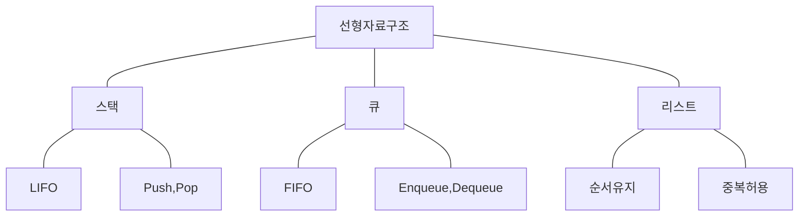

## 선형 자료구조 개념

## 스택 입출력 원리, 활용 예시

### 스택 입출력 원리

- 개념도

| 구분 | | 내용 |
| --- | --- | --- |
| 입출력 원리 | | LIFO 원칙으로 가장 마지막에 삽입된 데이터가 가장 먼저 나오는 자료구조 |
| 구성 | PUSH | 스택의 맨 위에 데이터 추가 |
| | POP | 스택의 맨 위에 잇는 데이터 제거하고 반환 |
| | TOP | 스택에서 삽입, 삭제가 일어나는 리스트의 끝 |

### 스택 활용 예시

- 괄호의 짝 검사
- 함수 호출, 복귀 순서 관리
- 웹 브라우저 히스토리
- 실행취소

## 큐 입출력 원리, 활용 예시

### 큐 입출력 원리

- 개념도

| 구분 | | 내용 |
| --- | --- | --- |
| 입출력 원리 | | 선형리스트 한 쪽에서는 삽입이 일어나고, 다른 한 쪽에서는 삭제만 이뤄지도록하여 먼저 들어온 데이터가 먼저 나가는 자료구조 |
| 구성 | Front | 리스트 맨 앞 출력부 |
| | Rear | 리스트 맨 뒤 입력부 |
| | Enqueue | Rear에 데이터를 삽입하는 작업 |
| | Dequeue | Front에서 데이터를 삭제하는 작업 |

### 큐 활용 예시

- 대기열에 사용: 서로 다른 쓰레드 사이, 프로세스 사이, 네트워크 데이터 전송
- 웹 서버 요청
- 너비 우선 탐색

## 리스트 입출력 원리, 활용 예시

### 리스트 입출력 원리

- 개념도

| 구분 | | 내용 |
| --- | --- | --- |
| 입출력 원리 | | 순서를 가진 데이터의 집합으로, 배열 기반 또는 링크드 리스트 기반으로 데이터 저장하는 자료구조
| 구성 | Insert | 리스트의 특정 위치에 데이터 삽입 |
| | Delete | 리스트 특정 위치의 데이터 제거 |

### 리스트 활용 예씨

- 트리, 그래프 등 계층 구조 구현
- 커널 모드 프로그래밍
