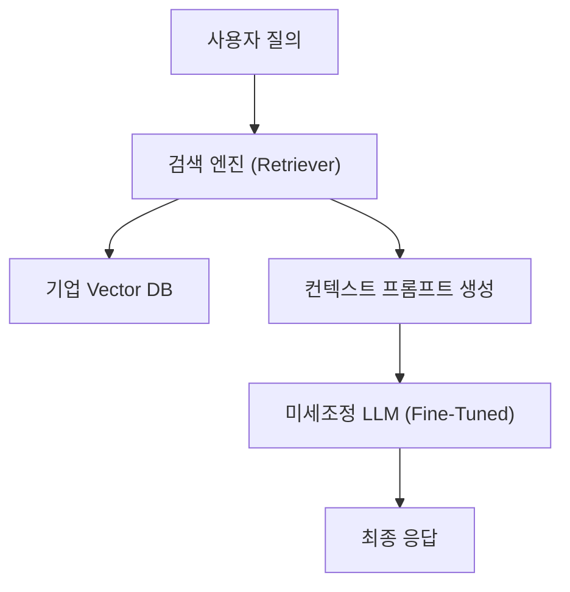

## LLM AX 학습 파이프라인의 개요

### LLM AX 학습 파이프라인의 개념
- 기업의 AI 전환(AX)을 위해 범용 대형언어모델(LLM)에 기업 내부 지식자산을 결합하여 ==도메인 특화 성능 및 신뢰성==을 고도화하는 학습 및 추론 최적화 아키텍처.
- 내재화된 파라미터 업데이트 방식(Fine-Tuning)과 외부 지식 연계 추론 방식(RAG)의 하이브리드 결합 모델 지향.

### LLM AX 학습 파이프라인의 필요성
- **도메인 정합성:** 내부 기밀 규정, 제품 명세 등 비공개 특화 지식에 대한 정확한 추론 필요.
- **최신성 및 환각 제어:** 실시간 데이터 미반영으로 인한 시간적 지체 방지 및 정보 왜곡(Hallucination) 최소화.

## 파인튜닝(Fine-Tuning)과 RAG의 개념 및 역할

### 하이브리드형 LLM AX 최적화 개념도

### 파인튜닝과 RAG의 개념 및 역할 비교
| 구분 | 파인튜닝 (Fine-Tuning) | RAG (Retrieval-Augmented Generation) |
| :--- | :--- | :--- |
| **개념** | 사전 학습된 LLM의 가중치(Weight)를 특화 데이터로 업데이트 | 질의에 부합하는 외부 지식을 검색(Search)하여 프롬프트에 결합 |
| **핵심 역할** | 모델의 말투, 출력 형식(JSON 등), 도메인 지식의 내재화 | 실시간 외부 데이터 접근성 확보 및 정보 근거 제시 |
| **데이터 반영** | 가중치에 물리적 반영 (정적 학습) | 프롬프트 컨텍스트에 동적 주입 (실시간 반영) |
| **장단점** | 지식 고밀도화 / 높은 학습 리소스 및 파라미터 왜곡 위험 | 외부 데이터 실시간성 / 컨텍스트 윈도우 크기 제약 |

## RLHF와 RAFT 기반 학습 파이프라인 비교

### RLHF 및 RAFT 기반 학습 메커니즘
- **RLHF 파이프라인:** SFT 모델 기반으로 인간 선호도 데이터셋 학습을 통한 Reward Model($R_{RM}$) 생성 후, PPO 알고리즘을 사용해 가중치를 정렬.
  - 가중치 붕괴 방지를 위해 KL-Divergence 패널티를 보상에 적용:
    $R_{\text{augmented}}(x, y) = R_{\text{RM}}(x, y) - \beta \cdot D_{KL}(\pi_{\theta}(y|x) || \pi_{\text{ref}}(y|x))$
- **RAFT 파이프라인:** 오픈북 RAG 환경을 모방하여, 질문과 함께 Oracle 문서($D_*$, 정답 포함) 및 Distractor 문서($D_k$, 무관한 노이즈)를 혼합 주입 후 Chain-of-Thought(CoT)로 추론하도록 SFT 진행.
  - 노이즈 문서 속에서 정답 문서의 근거를 발췌하는 RAG 독해력 자체를 내재화.

### RLHF와 RAFT 파이프라인의 특성 비교
| 구분 | RLHF 기반 파이프라인 | RAFT 기반 파이프라인 |
| :--- | :--- | :--- |
| **최적화 목적** | 인간의 윤리적 가치, 지시 이행 선호도(Alignment)에 모델 정렬 | 도메인 특화 RAG 적용 시 노이즈 필터링 및 독해 성능 극대화 |
| **데이터 구성** | 인간이 평가한 비교 쌍 데이터 (Pairwise Preference Dataset) | 질문 + 정답 문서(Oracle) + 무관 문서(Distractor) + CoT 답변 |
| **핵심 알고리즘** | 강화학습 (PPO Policy Gradient, Actor-Critic) | 지도학습 (CoT 기반 Supervised Fine-Tuning) |
| **구축 한계** | 고비용의 인간 피드백 비용 및 RL 학습의 불안정성(Reward Hacking) | Distractor 비중에 따른 학습 데이터셋 구축 난이도 존재 |

## LLM AX 시스템 도입 시 실무적 고려사항

### 단계별 장애 요인 및 극복 방안
| 구분 | 문제점 | 해결방안 |
| :--- | :--- | :--- |
| **기술적 관점** | 무분별한 파인튜닝 시 Catastrophic Forgetting(기존 지식 망각) 발생 | PEFT(LoRA/QLoRA) 도입 및 원본 모델과의 가중치 보존 비율 조정 |
| **보안적 관점** | RAG 구동 시 외부 문서 유출 및 민감 개인정보 유출 위험 | 데이터 익명화 필터링 적용 및 엔터프라이즈 권한 제어(IAM) 연계 |
| **비즈니스 관점** | 데이터셋 가공(Annotation) 및 GPU 서버 유지 비용 가중 | 소형 오픈소스 모델(sLLM) 다중화 및 RAG-First 하이브리드 아키텍처 채택 |

### 차세대 기술 융합 및 미래 활성화 방안
- **에이전틱 AI(Agentic AI) 연계:** 향후 단일 LLM을 넘어 도구 사용(Tool Use) 능력을 결합한 멀티 에이전트 시스템으로 확장하여 기업 업무 프로세스 자동화를 AX의 종착지로 설정.
- **온디바이스 AI 결합:** Edge 단말에서의 초경량 sLLM 파인튜닝과 중앙 서버의 하이브리드 RAG 망 구성을 병행하여 인프라 비용 저감 및 응답 속도 최적화 실현
