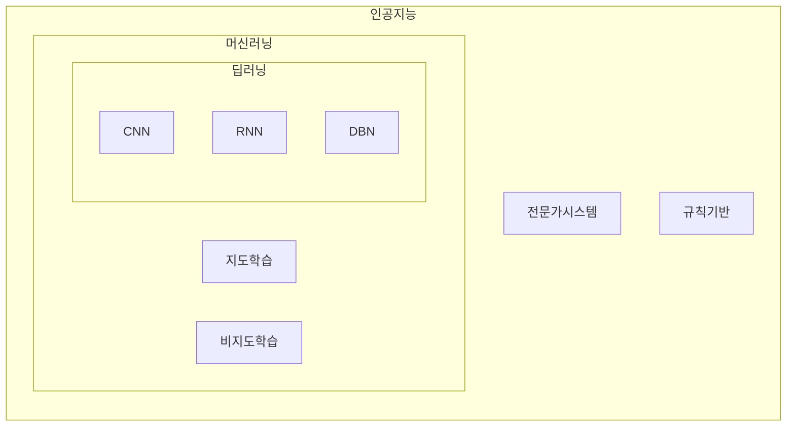

## 머신러닝, 딥러닝 개념

- 머신러닝: 입력 데이터를 스스로 학습하여 결과를 예측하거나 분류하는 기술
- 딥러닝: 인공신경망에서 은닉층을 깊게 쌓은 머신러닝 기법

## 머신러닝, 딥러닝 핵심요소 비교, 적용방안

### 머신러닝, 딥러닝 핵심요소 비교

| 구분 | 머신러닝 | 딥러닝 |
| --- | --- | --- |
| 특징 | 사람의 개입 | 사람 개입 최소화 |
| 학습구성 | 지도, 비지도, 강화 | 인공신경망 |
| 알고리즘 | 선형회귀, 의사결정나무, SVM, K-means 등 | CNN, RNN, GAN, DBN 등 |
| 활용 | 예측, 분류 | 예측, 분류, 생성 |
| 성능 | 적은 데이터에서 우수한 성능 | 대규모 데이터에서 우수한 성능 |
| - | 복잡한 패턴인식 한계 | 복잡한 패턴인식 가능 |

### 머신러닝, 딥러닝 적용방안

| 구분 | 머신러닝 | 딥러닝 |
| --- | --- | --- |
| 금융 | 신용점수예측, 사기탐지 | 주가예측, 금융모델링 |
| 의료 | 진단보조, 환자위험도 평가 | 의료이미지분석, 유전자분석 |
| 커머스 | 고객행동분석, 추천시스템 | 고객감정분석, 행동패턴분석 |

## 머신러닝 성공포인트

| 구분 | 포인트 | 내용 |
| --- | --- | --- |
| 기술측면 | Zero-Shot 학습 | 학습 비용의 효율화 |
| - | 1-Bit 가중치 인코딩 | 저장 비용의 효율화 |
| 에너지측면 | 태양열 에너지 | 에너지 사용 학습 비용 절감 |
| - | 소형모듈원전 | 모듈화 원전으로 학습 에너지 충족 |

- 학습, 저장 비용의 효율화와 에너지 비용절감을 통해 탄소인지 MLOps 환경 구축 필요
