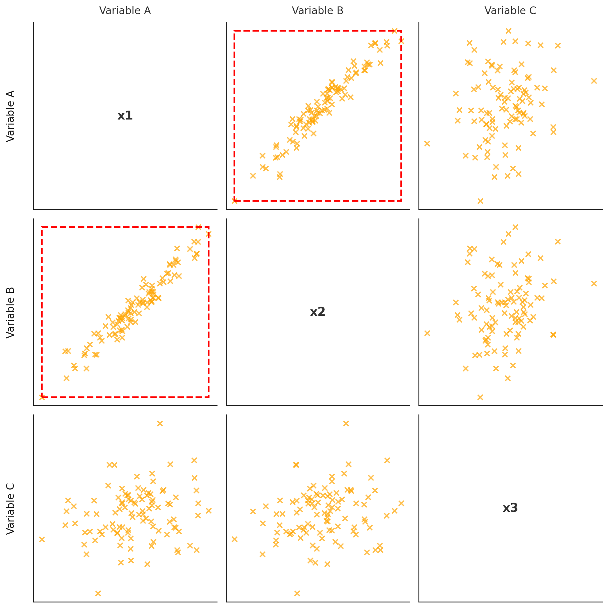

## 다중공선성 개념

- 다중회귀분석에서 일부 독립변수들 간 높은 상관관계가 존재해 데이터 분석시 부정적인 영향을 미치는 현상
- 독립 변수 간 상관관계, 예측 신뢰도 저하, 모델 해석의 어려움

## 다중공선성 개념도, 상세설명

### 다중공선성 개념도

- 독립변수 간 상관관계가 강하여 결정계수 값이 높아 과적합 발생

### 다중공선성 상세설명

| 구분 | 항목 | 내용 |
| --- | --- | --- |
| 판단기준 | 상관계수 | 독립변수 간 상관계수가 0.7 이상인 경우 의심 |
| - | 분산팽창요인 | VIF 값이 10을 넘는 경우 다중공선성 존재 판단 |
| - | 결정계수 | $R^2$는 높지만 p-value도 높은 경우 의심 |
| 해결방법 | 변수제거 | 상관 관계를 가진 변수를 제거하여 공선성 완화 |
| - | 변수변환 | 로그변환, 정규화 통한 변수 관계 조정 |
| - | PCA | 고차 데이터를 선형독립적인 주성분으로 변환하여 공선성 제거 |
