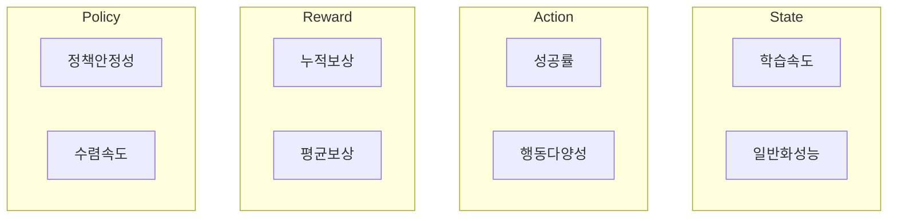

## 머신러닝 성능지표 개념

- 실제 값과 모델에 의해 예측ㄷ된 값을 비교하여 머신러닝 모델이 얼마나 잘 학습했는지 평가하기 위한 지표
- 지도학습, 비지도학습, 강화학습 별 다른 성능지표 활용

## 머신러닝 성능지표 상세

### 지도학습 성능지표

| 구분 | 성능지표 | 설명 |
| --- | --- | --- |
| 회귀 | MSE | 오차를 제곱하여 평균, 값이 작을수록 우수 |
| - | RMSE | MSE의 제곱근, 해석을 용이하게 변환 |
| - | MAE | 오차의 절대값의 평균, 이상치에 덜 민감 |
| - | R^2 | 회귀모델의 설명력을 표현, 1에 가까울수록 우수 |
| 분류 | 정확도 | 올바르게 예측한 비율, 클래스 불균형에 민감 |
| - | 정밀도 | Positive로 예측한 것 중 실제 Positive 비율 |
| - | 재현율 | 실제 Positive 중 Positive로 예측한 비율 |
| - | F1 Score | 정밀도와 재현율의 조화평균, 불균형 데이터셋에 우수 |
| - | AUC | ROC Curve의 면적, 종합적 성능 평가, 1에 가까울수록 우수 |

- 분류모델 성능 평가시 혼동행렬 작성 선행 필요

### 비지도학습 성능지표

| 구분 | 성능지표 | 설명 |
| --- | --- | --- |
| 클러스터링 | 실루엣 지수 | 클러스터의 밀집 정도를 계산, 1에 가까우면 높은 성능 |
| - | Dunn Index | 군집 간 거리의 최소값, 군집 내 요소 간 거리 최대값의 비율 |
| 차원축소 | 재구성오차 | 축소 복원시 원본과의 오차를 평가 |
| - | 설명분산비율 | 축소된 차원에서 전체 데이터 분산 중 설명되는 비율 |
| - | 스트레스 | 저차원 공간에서 고차원 데이터 간 거리의 보존 정도를 평가 |

### 강화학습 성능지표

