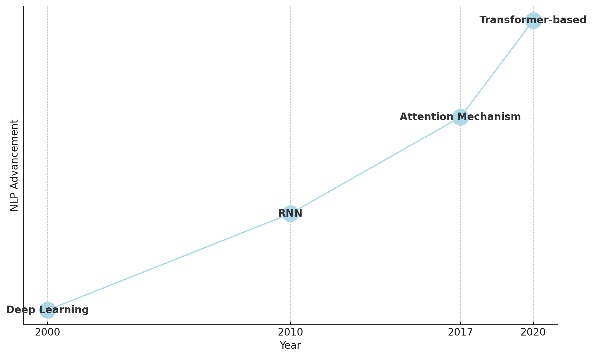
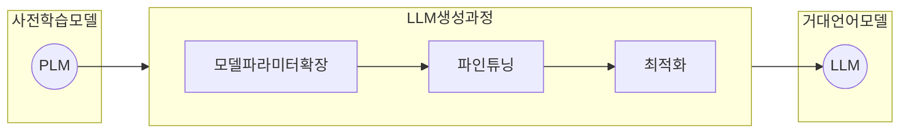

## 자연어 모델 개요

- 트랜스포머 구조 등장으로 자연어 처리능력이 비약적으로 상승, 생성형 AI시대 진입

## PLM 개념 및 특성

### PLM 개념

- 대규모 텍스트 코퍼르소부터 언어 패턴을 사전 학습한 자연어 처리 모델
- BERT, GPT 등이 주요한 Pre-trained Language Model로 활용

### PLM 특성

| 특성 | 설명 | 비고 |
| --- | --- | --- |
| 사전학습 | 대규모 텍스트 데이터로 비지도학습 수행 언어의 통계적 특성 학습 | BERT, GPT |
| 범용성 | 다양한 NLP 작업에 적용 가능 전이학습으로 성능 개선 가능 | 텍스트생성, 감정분석 |
| 언어이해능력 | 중요 단어에 더 큰 가중치 부여하여 학습 문맥적 의미 반영한 표현 생성 | 어텐션 매커니즘 |

## LLM 생성과정 및 특성

### LLM 생성과정

- PLM에서 파라미터를 비약적으로 늘려 범용 성능을 가진 LLM 생성

### LLM 특성

| 특성 | 설명 | 기대효과 |
| --- | --- | --- |
| 초대형 파라미터 | 수십억-수천억개 이상 파라미터 확장 다양한 문맥정보를 정교하게 표현 | Few-shot, Zero-shot 응답 |
| 범용성 확대 | 파인튜닝, RLHF 등을 통해 응답 품질개선 다중언어, 다분야 처리능력향상 | 범용 AI |
| 인간수준 자연어생성 | 최적화를 통한 완결성있는 문장 생성 대화의 맥락 추론 가능 | 태스크 자동화, 효율화 |

## PLM과 LLM 비교

| 구분 | PLM | LLM |
| --- | --- | --- |
| 데이터규모 | 수억-수십억 토큰 | 수십억-수조 토큰 |
| 모델파라미터 | 수천만-수억 개 | 수십억-수천억 개 |
| 학습방식 | 사전학습, 파인튜닝 | 사전학습, 파인튜닝, 인스트럭션 튜닝 |
| 응용범위 | 특정 작업시 전이학습 필요 | 다양한 작업에 높은 성능 |
| 컴퓨팅 파워 | 상대적 낮음 | 고성능 GPU 필요 |
