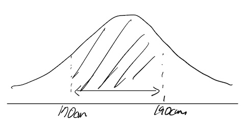

## 점추정, 구간추정 개념 비교

| 구분 | 점추정 | 구간추정 |
| --- | --- | --- |
| 개념도 |  |  |
| 개념 | ==모집단의 모수를 단일 값으로 추정==하는 방법 | ==모집단의 모수가 포함될 것으로 예상되는 구간을 추정==하는 방법 |
| 특징 | 추정 간편, 간단한 계산 | 추정값의 ==신뢰도를 포함==한 정보 제공 |

## 점추정, 구간추정 개념도, 상세 비교

### 점추정, 구간추정 개념도 비교

- 점추정은 하나의 값, 구간추정은 신뢰 구간을 추정하는 방법

### 점추정, 구간추정 상세 비교

| 구분 | 점추정 | 구간추정 |
| --- | --- | --- |
| 추정값 | ==단일수치값== | ==하한값과 상한값 범위== |
| 불확실성표현 | 직접표현안함 | 신뢰구간을 통해 표현 |
| 성질 | 불편성, 효율성, 일치성, 충분성 | 신뢰성 |
| 방법 | ==MSE, 적률법, 최대가능도== | ==표준정규분포, t분포== |
| 사용용이성 | 계산 간단, 해석 용이 | 계산 복잡, 높은 신뢰도 |
| 정보량 | 단일 추정치, 제한된 정보 | 범위, 신뢰수준 등 추가 정보 제공 |
