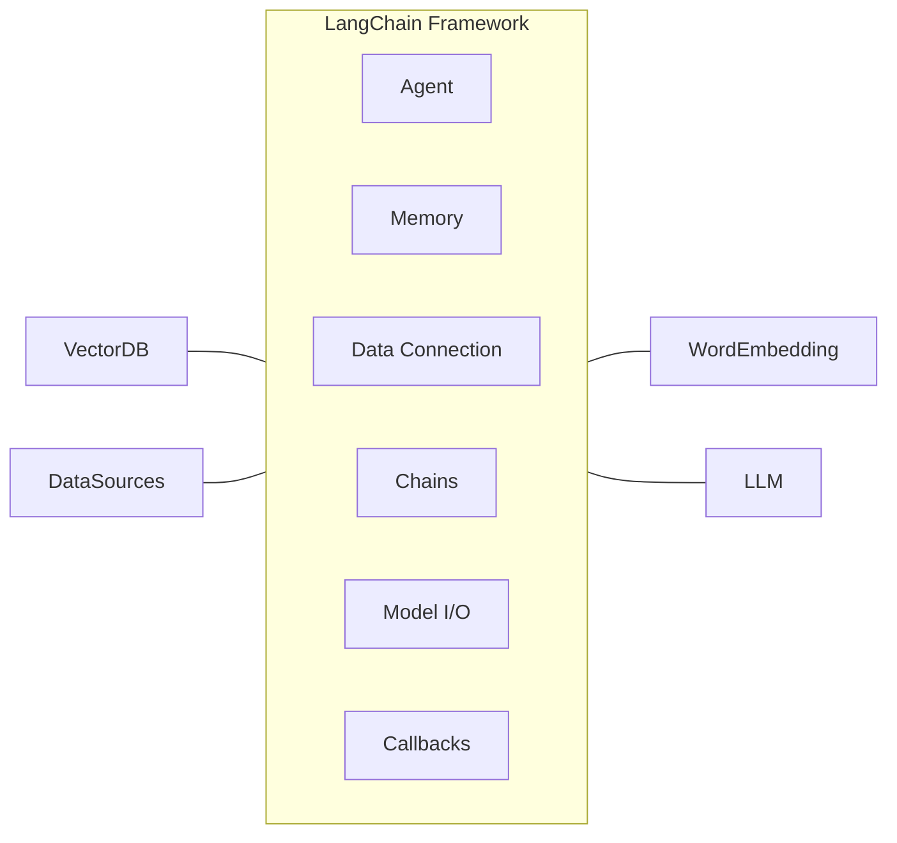
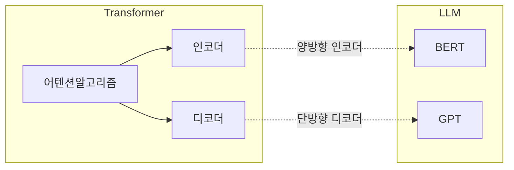
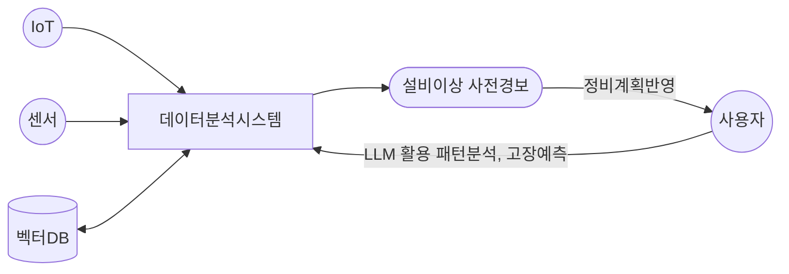

## 설비 예지정비 개념

- 설비의 상태 데이터를 분석하여 고장 가능성을 사전에 예측하고, 필요한 유지보수를 미리 수행함으로써 비계획적인 가동 중단을 방지하고 설비 수명을 연장하는 기술
- 장비 신뢰성 향상, 운영 효율성 극대화, 유지보수 비용 절감, 안전성 강화, 생산성 증대, 데이터 활용 극대화

## LangChain 프레임워크, LLM

### LangChain 프레임워크 개념

- 대규모 언어모델을 활용한 서비스 개발 시 여러 언어모델과의 통합을 간소화하도록 설계된 애플리케이션 개발 프레임워크

### LLM 개념

- 대량의 텍스트 데이터를 학습하여 인간과 유사한 언어 이해 및 생성 능력을 갖춘 초거대 언어 AI 모델

## LangChain을 이용한 설비 예지정비

### LangChain을 이용한 설비 예지정비 매커니즘

### LangChai을 이용한 설비 예지정비 기능

|구분|기능|상세 설명|
|---|---|---|
|데이터 수집|IoT 및 센서 통합|실시간 제조설비 데이터 수집 및 저장|
|데이터 분석|LLM 기반 패턴 분석|이상 징후 탐지, 고장 원인 규명, 상관분석 수행|
|프로세스 마이닝|핵심 프로세스 분석|빅데이터 기반으로 설비 운영 프로세스 최적화|
|진단/관리/정비|이상 진단 및 사전 경고|고장 예측 및 사전 경고 시스템 구축|
|사용자 인터페이스|직관적 시각화|대시보드 형태로 실시간 상태 모니터링 제공|
