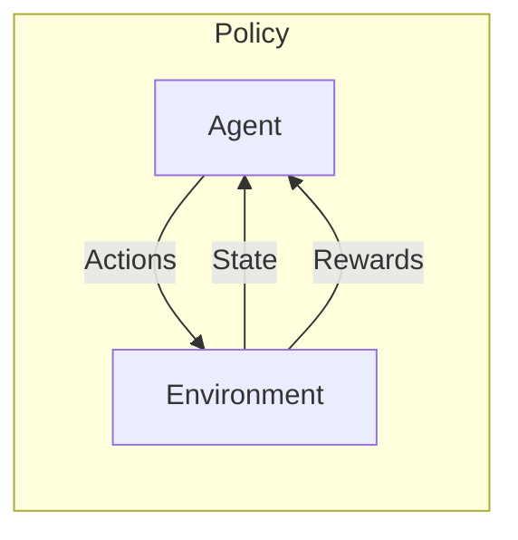

## 강화학습 개념

- 에이전트가 환경과 상호작용하여 보상을 최대화하는 행동을 학습하는 방법
- 복잡한 환경에서의 문제 해결, 환경 상호작용, 보상 기반 학습

## 강화학습 구성도, 주요 알고리즘, 적용방안

### 강화학습 구성도

- 상태를 인식하고, 행동을 취하며, 보상을 최대화하는 최적의 정책 학습

### 강화학습 주요 알고리즘

| 구분 | 내용 | 비고 |
| --- | --- | --- |
| Q-Learning | 가치기반 학습방법, 각 상태-행동 쌍에 대한 가치를 업데이트하여 최적 정책 학습 | 오프라인학습, 단순 문제 |
| SARSA | 실제 정책을 사용하여 상태-행동 가치함수를 학습하는 시간차 방법 | 온라인 학습 |
| DQN | 딥러닝을 이용한 Q-Learning, 신경망을 사용하여 Q값을 근사 처리 | 복합한 문제 |
| Policy Gradient | 보상 기대값을 최대화하는 방향의 정책을 직접 학습 | 연속적 행동 적합 |
| Actor-Critic | 정책기반과 가치기반 알고리즘 결합, 액터는 정책경사모델로 행동 결정, 크리틱은 Q러닝으로 행동 비평 | 안정성, 효율성 |

### 강화학습 적용방안

| 구분 | 내용 | 비고 |
| --- | --- | --- |
| 게임AI | 게임 내 최적 전략을 학습하여 사람과 경쟁가능한 AI 개발 | Starcraft, Dota2 |
| 로봇제어 | 로봇 움직임을 강화학습하여 자율적 환경 탐색 및 작업 수행 | 자율주행, 드론제어 |
| 금융거래 | 거래 데이터로 강화학습하여 최적의 거래 전략 학습/적용 | 리스크 관리, 포트폴리오 최적화 |

## 강화학습 고려사항

- Exploitation과 Exploration 사이의 적절한 균형을 찾는 알고리즘 선택
