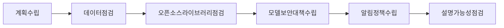

## 인공지능 시스템 신뢰성 제고를 위한 요구사항 개요

### 인공지능 시스템 신뢰성 제고를 위한 요구사항 개념

- 인공지능 기술이 적용된 시스템의 신뢰성 제고를 위해, 인공지능 개발 및 운영 등의 전체 ==인공지능 생명주기==에서 ==이해관계자들이 충족해야할 요구사항== 제공

### 인공지능 시스템 신뢰성 제고를 위한 요구사항 필요성

| 구분 | 내용 | 비고 |
| --- | --- | --- |
| 위험 관리 | 오류, 오작동, 보안 위협 등 잠재적 위험 요소 식별 및 대응 방안 마련 | 리스크 관리 및 대응 |
| 신뢰 확보 | 작동 원리와 결과 명확히 설명, 예측 가능성 및 투명성 확보  | 시스템 투명성 및 예측 가능성 확보 |
| 규제 준수 | 법적 규제와 표준 준수, 책임성 강화 및 사회적 수용성 증대  | 법적 준수 및 사회적 책임 |

## 인공지능 시스템 신뢰성 제고를 위한 요구사항 구성도, 구성요소

### 구성도

### 구성요소

| 구성 | 내용 | 비고  |
| --- | --- | -- |
| 계획 수립 | 위험 관리, 신뢰성 테스트 계획 수립 | 생명주기 전 영역 |
| 데이터 점검 | 신뢰성 있는 데이터인지 점검  | 안정성, 공정성, 견고성 |
| 오픈소스 점검 | 보안성, 기능성 점검 | 개발단계 전 보안성 확보 |
| 모델 보안 대책 수립 | 편향, 적대적공격 방어 점검 | 지속적 평가 |
| 알림 정책 수립 | 장애 발생시 절차 수립  | 안전모드, 알림 등 |
| 설명가능성 점검  | 추론 결과 확인, 상호작용 설명 | 투명성, 서비스 오남용 방지 |

- AI 생명주기 전 영역에서 인공지능 시스템 신뢰성 제고를 위한 활동 필요.

## AI 시스템 생명 주기별 요구사항

| 구분 | 내용 | 비고 |
| --- | --- | --- |
| 계획 및 거버넌스 | 위험관리 계획, 거버넌스 체계 | 위험 분석, 법 규정 수립 |
| 설계 및 개발 | 신뢰성 테스트 계획, 이상 데이터 점검, 편향 제거, 보안성 점검 | 테스트 환경 설계, 데이터 견고성, 편향 제거, 보안 패치 점검 |
| 검증 및 확인 | 추적 가능성 확보, 모델 설명 제공  | 데이터 추적, 모델 설명 |
| 배치 및 운영 | 모델 방어 대책, 안전 모드, 알림 절차 수립  | 방어 방안, 안전 모드 구현, 알림 기능 |
| 지속적 관리 | 데이터 정보 제공, 모델 편향 제거, 시스템 편향 제거  | 데이터 투명성, 알고리즘 편향 제거 |
| 서비스 종료 | 서비스 범위 설명 | 오남용 방지 |

- 지속적 확인단계는 서비스 운영 중 지속적인 학습을 수행하는 경우 한해 적용

## AI 시스템 신뢰성 제고를 위한 고려사항

| 구분 | 내용 | 비고 |
| --- | --- | --- |
| 기술적 | 인공지능 시스템의 추적 가능성 및 변경 이력 관리 | 시스템 모니터링 |
| 관리적 | 위험 관리 계획 수립 및 실행 | 리스크 관리 |
| 제도적 | 데이터 프라이버시 및 보안에 대한 제도적 관리 | 프라이버시 보호 |

## 기타

### AI 시스템 이해관계자

- AI제공자: 플랫폼 제공자, 서비스 제공자
- AI생산자: AI개발자, 데이터 과학자
- AI고객: 서비스 사용자, 서비스 운영자
- AI파트너: 시스템 통합자, 데이터 공급자
- AI영향대상: 데이터 영향대상, 시민 단체
- 관계기관: 규제기관, 정책입안자

### 해외 AI 신뢰성 요구사항

- 유네스코: 인공지능 윤리권고
- EU: The Assessment List on Trustworthy Artificial Intelligence

## 참조

- [AI 신뢰성 센터](https://aitrustops.or.kr/common/bbs/tcntr/selectBbs.do?bbs_seq=7661&sch_text=&currentPage=1)
