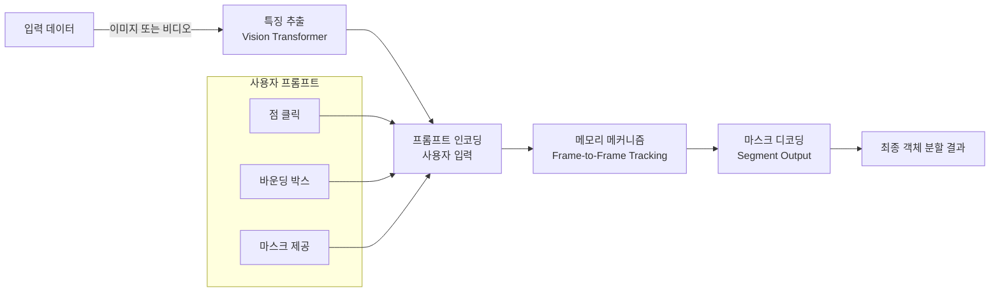

## SAM 개념

- 사용자 프롬프트(점, 박스, 마스크 등) 에 따라 정확한 객체 분할을 수행하는 딥러닝 기반 실시간 객체 분할 모델
- Transformer 아키텍처와 메모리 메커니즘을 활용하여 이미지 및 비디오에서 객체를 빠르고 정확하게 분할, Zero-shot 세그멘테이션 가능

## SAM 개념도, 동작 절차, 활용 사례

### SAM 개념도

### SAM 동작 절차

| 절차 | 내용 | 비고 |
| --- | --- | --- |
| 특징 추출 | 입력된 이미지/비디오에서 고수준 특징을 추출 | Vision Transformer 활용 |
| 프롬프트 인코딩 | 사용자의 입력(점, 바운딩 박스, 마스크 등)을 인코딩하여 분할 수행 | Zero-shot 학습 가능 |
| 메모리 메커니즘 | 이전 프레임의 정보를 활용하여 연속된 객체 추적 | 비디오 객체 분할 지원 |
| 마스크 디코딩 | 객체 분할 마스크를 생성하여 최종 결과 출력 | 실시간 처리 가능 |

### SAM 활용사례

| 구분 | 사례 | 설명 |
| --- | --- | --- |
| 비디오 편집 | 특정 객체 분리 | 영상에서 특정 객체를 분리하여 편집 효과를 적용 |
| 증강 현실 (AR) | 실시간 객체 추적 | 실제 환경에서 가상 객체와의 인터랙션을 강화 |
| 의료 영상 분석 | 의료 영상에서 관심 영역 탐지 | MRI, CT 스캔에서 특정 병변을 자동 분할 |
| 자율 주행 | 도로 객체 실시간 인식 | 차량, 보행자, 도로 표지판 등의 분할 및 인식 |
| 보안 및 감시 | 움직이는 물체 실시간 탐지 | CCTV에서 이상 행동 감지 및 객체 식별 |

## YOLO, SAM 비교

| 구분 | YOLO (You Only Look Once) | SAM 2 (Segment Anything Model 2) |
| --- | --- | --- |
| 목적 | 객체 감지 (Object Detection) | 객체 분할 (Segmentation) |
| 주요 기능 | 바운딩 박스로 객체 위치 예측 | 픽셀 단위 객체 분할 |
| 입력 데이터 | 이미지, 비디오 | 이미지, 비디오 |
| 출력 결과 | 객체의 바운딩 박스 + 클래스 라벨 | 객체의 분할 마스크 |
| 처리 방식 | 단일 패스로 CNN 기반 객체 감지 | Transformer 기반 프롬프트 분할 |
| 프레임워크 | CNN 기반 YOLO 아키텍처 | Vision Transformer 기반 모델 |
| 사용자 프롬프트 | 없음 (자동 탐지) | 점, 바운딩 박스, 마스크 입력 가능 |
| 비디오 지원 | 가능 (Frame-by-Frame 감지) | 가능 (Frame-to-Frame 추적) |
| 활용 분야 | 자율주행, 감시 시스템, 드론, 스마트시티 | 영상 편집, 의료 분석, AR/VR, 보안 |
| 장점 | 실시간 감지, 속도 최적화 | 정밀한 객체 분할, Zero-shot 세그멘테이션 |
| 단점 | 객체 분할 불가능, 픽셀 수준 정보 부족 | 감지 불가능, 바운딩 박스 제공 안됨 |

- YOLO는 "어디에 무엇이 있는가?"(객체 감지) 를 해결하는 반면, SAM 2는 "정확한 경계를 찾아라"(객체 분할) 에 집중
