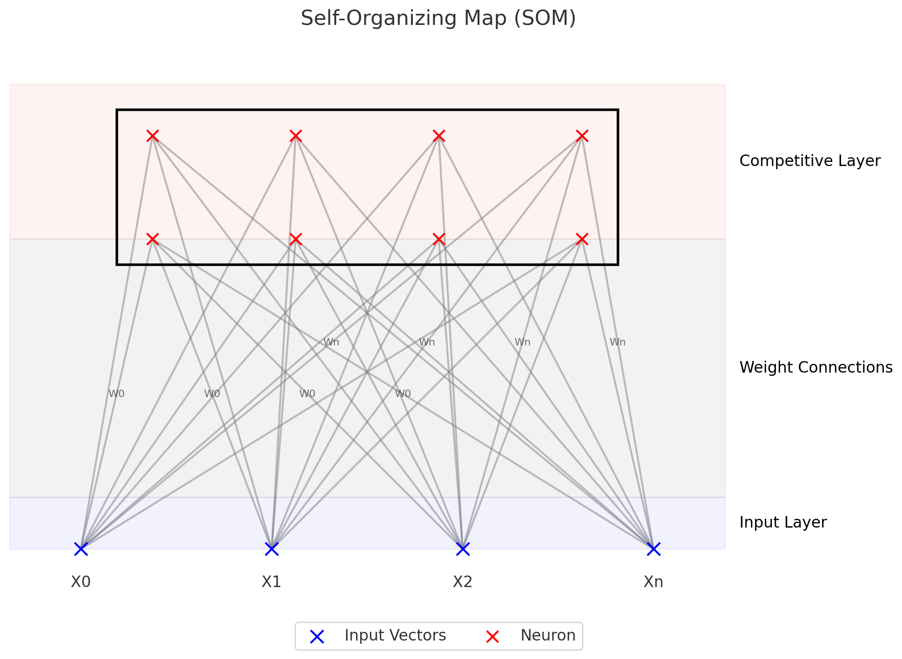

## SOM 개념

- ==고차원 데이터의 위상을 보존==하여 ==저차원 그리드로 매핑==하는 비지도학습 기반 인공 신경망
- 차원축소, 위상보존, 경쟁학습, 시각화 및 군집화

## SOM 구성도, 구성요소, ANN과의 차이점

### SOM 구성도

- 경쟁층 뉴런들이 2차원 격자구조로 배열, 고차원 입력 데이터를 저차원 공간에 시각적으로 표현하는 구조

### SOM 구성요소

| 구분 | 구성요소 | 설명 |
| --- | --- | --- |
| 레이어 | 입력층 | 고차원 입력 특성을 받는 층 |
| | 경쟁층(출력층) | 2D 그리드 구조로 입력 데이터와의 거리 측정 후 가장 가까운 뉴런 선정 |
| 연결요소 | 연결가중치 | 입출력층 연결, 초기 무작위 가중치 설정 후 경쟁학습을 통해 업데이트 |
| | BMV | 입력벡터와 가장 유사한 출력층 뉴런, 유클리드 최소 거리 계산 |

- 역전파와 체인룰 없이 승자 독식 경쟁학습 알고리즘 사용

### SOM과 ANN의 차이점

| 구분 | SOM | ANN |
| --- | --- | --- |
| 학습방식 | 비지도학습 | 비지도/지도학습 |
| 학습알고리즘 | 경쟁학습 | 역전파 등 오류수정기반 |
| 주요목적 | 시각화, 군집화, 차원축소 | 분류, 회귀, 예측 |
| 출력구조 | 2차원 격자 | 다층 퍼셉트론 |
| 데이터 요구사항 | 레이블 불필요 | 레이블 필요 |
| 활용사례 | 데이터 시각화, 군집 분석 | 이미지 인식, 음성 인식, 자연어 처리 |
| 해석가능성 | 결과의 직관적 해석 | 블랙박스, 해석 어려움 |
