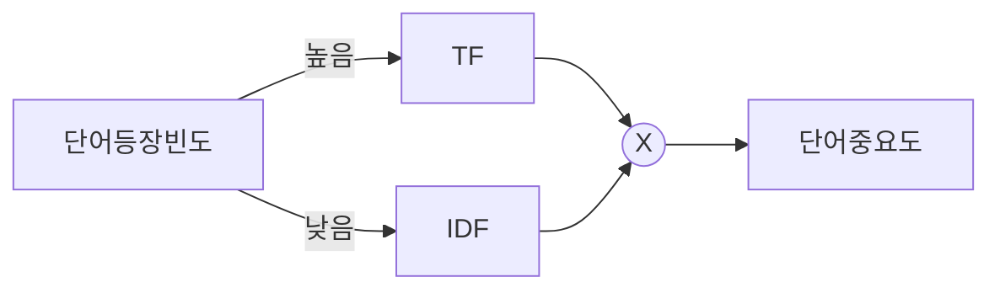

## TF-IDF 개념

- 정보검색과 텍스트마이닝에서 여러 문서 내 어떤 단어가 문서 내에서 얼마나 중요한 것인지를 나타내는 통계적 가중치

## TF-IDF 구성, 산출방법, 활용분야

### TF-IDF 구성

| 구분 | 내용 | 비고 |
| --- | --- | --- |
| TF | 특정 단어가 문서 내에서 얼마나 자주 등장하는지 나타내는 값 | Boolean 빈도, 로그 스케일빈도, 증가 빈도 |
| DF | 특정 단어가 문서 집합 전체에서 나타나는 빈도 | 높을시 흔한 단어 |
| IDF | 전체 문서 수를 해당 단어를 포함한 문서 수로 나눈 후 로그 처리 | 높을시 중요 단어 |
| TF-IDF | 특정 문서 내에서 단어 빈도가, 전체 문서 중 그 단어를 포함한 문서가 적을 수록 높아짐 | $TF*IDF$ |

### TF-IDF 산출 방법

| 단어 | 문서1 | 문서2 | TF | DF | IDF |
| --- | --- | --- | --- | --- | --- |
| 엔진 | 15 | 10 | 25 | 2 | 0 |
| 모터 | 3 | 0 | 3 | 1 | 0.301 |
| 타이어 | 2 | 3 | 5 | 2 | 0 |

- 통상적으로 분모에 1을 더하여 로그를 취함
- 엔진: 0, 모터: 0.903, 타이어: 0
- 식별결과 '모터'가 가장 중요한 단어로 판단

### TF-IDF 활용분야

| 구분 | 설명 | 예시 |
| --- | --- | --- |
| 검색 엔진 | 사용자가 입력한 키워드와 가장 관련성 높은 문서 검색 | 검색 순위 결정 |
| 문서 분류 및 클러스터링 | 문서를 주제별로 분류하거나 유사한 문서를 그룹화 | 뉴스 기사 자동 분류 |
| 텍스트 요약 및 키워드 추출 | 중요한 키워드를 추출하여 텍스트를 요약 | 논문 초록 생성 |
