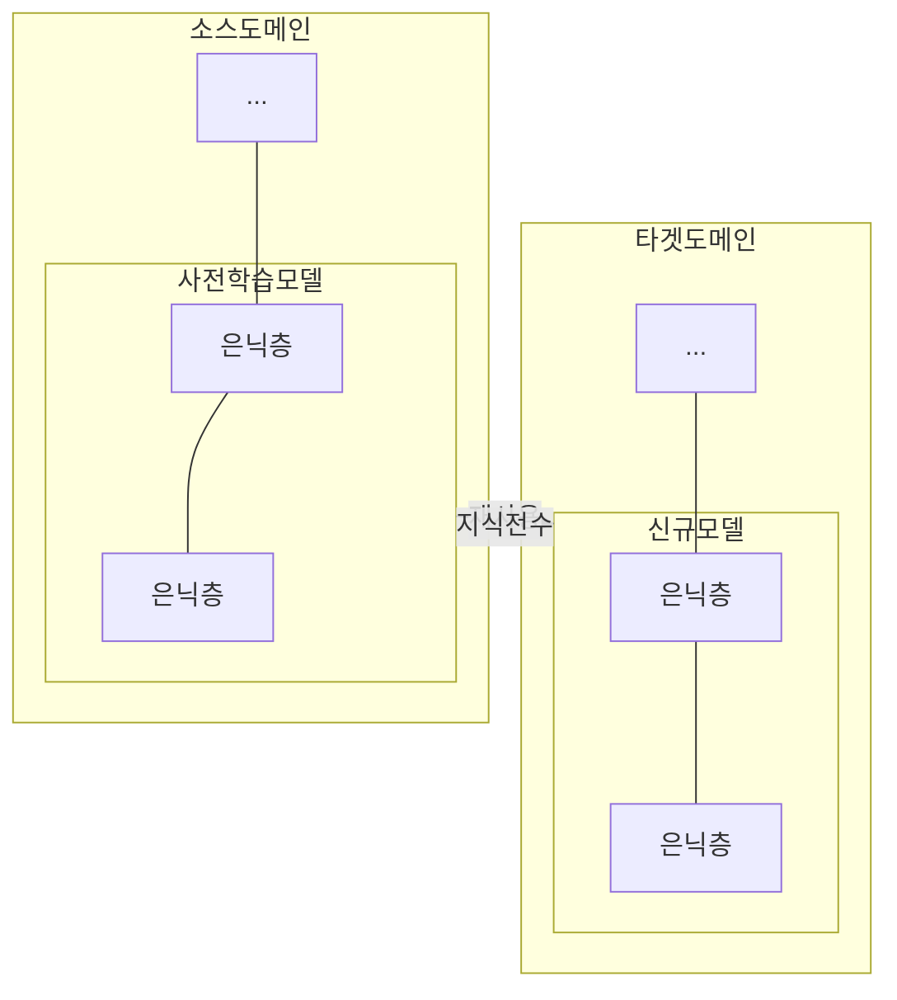

## 전이학습 개념

- 한 도메인에서 학습된 모델이나 지식을 다른 모데인으로 전이하여 학습 성능을 향상시키는 기법
- 데이터 부족 문제 해결, 학습시간 단축, 모델성능 향상, 컴퓨팅 리소스 절약

## 전이학습 구성도, 구성요소, 적용방안

### 전이학습 구성도

- 전이학습시 전수되는 은닉층은 가중치 고정, 나머지 은닉층은 타겟도메인에 맞게 미세조정

### 전이학습 구성요소

| 구분 | 내용 | 비고 |
| --- | --- | --- |
| 소스도메인 | 기존 학습 데이터 및 모델이 있는 도메인 | 풍부한 데이터 보유 |
| 타겟도메인 | 지식 전이하여 학습할 신규 도메인 | 데이터 부족 해결 |
| 특징 추출기 | 소스 도메인에서 추출된 중요 특징을 타겟 도메인 모델 활용 | 초기 가이드라인 제공 |
| 모델 최적화 | 타겟도메인 데이터를 통해 모델 재학습 또는 미세조정 | 성능 최적화 |

### 전이학습 적용방안

| 구분 | 내용 | 비고 |
| --- | --- | --- |
| 자연어 처리 | 번역 및 감정분석시 사전학습 언어모델 활용하여 신규언어 적용 | 확장성, 적응력 향상 |
| 게임 개발 | 캐릭터 및 환경 생성시 사전학습 모델활용 컨텐츠 생성 | 학습시간 단축, 현실감 |
| 의료 진단 | X-Ray, MRI 등 의료 이미지 분석시 사전 학습모델 미세조정 활용 | 희귀 질병 진단 가능 |

## 전이학습 고려사항

- 소스도메인에서 사용된 모델이 타켓도메인에 적합한지 적절성 평가 필요
- 학습률 조정, 드롭아웃 등 정규화 기법을 통해 과적합 방지
