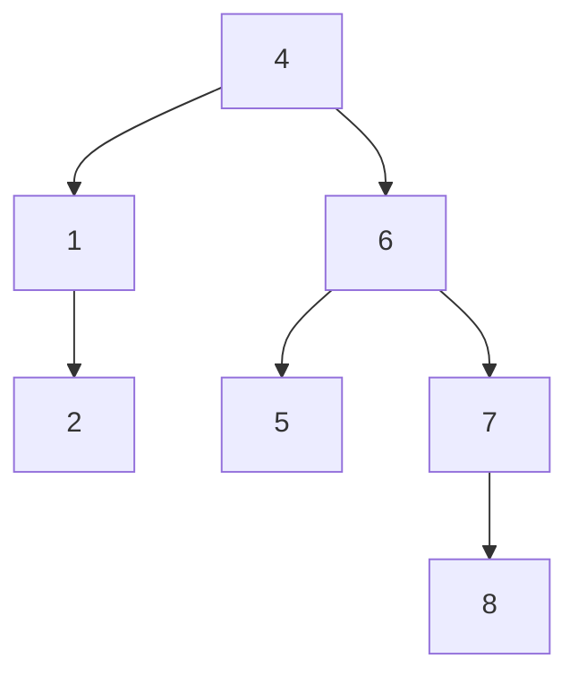

## 트리정렬 개념

- 이진 탐색 트리를 만들어 데이터를 정렬하는 알고리즘
- 각 요소에 따라 부모노드의 자식을 좌,우로 결정

## 트리정렬 개념도, 특징, 적용방안

### 트리정렬 개념도

- 중위 순회로 정렬

### 트리정렬 특징

| 구분 | 내용 | 비고 |
| --- | --- | --- |
| 시간복잡도 | 균형이 무너지면 최악케이스 | $$O(nlogn)$$ $$O(n^2)$$ |
| 공간복잡도 | 트리구조 저장 구조 필요 | $$O(n)$$ |
| 안정성 | 동일한 값의 순서 보장 불가 | 불안정 정렬 |
| 사용 트리 | 트리 균형을 유지해야 성능 향상 | BST, AVL 등 |

### 트리정렬 적용방안

| 구분 | 내용 | 비고 |
| --- | --- | --- |
| 데이터 셋 | 중간 크기의 데이터 세트에 가장 효과적인 정렬 | 빅데이터인 경우 메모리 사용량 폭증 |
| 데이터 분포 | 랜덤으로 분포된 데이터 정렬시 효율적 | 군집의 경우, 편향트리 처리 |
