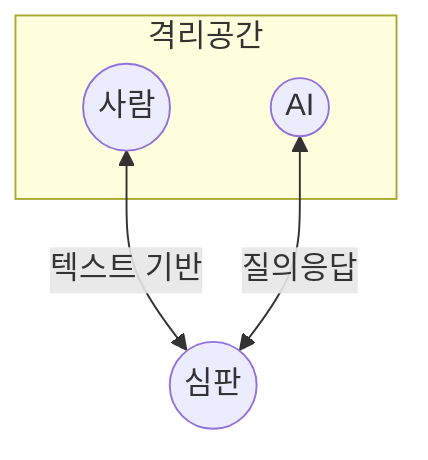

## 튜링테스트 개념

- 인공지능의 수준을 평가하기 위해 인간과 인공지능의 사고능력을 비교하는 블라인드 테스트
- 자연어 처리기술 발전, 기계와 인간 구분의 모호성, AI활용 서비스 증가

## 튜링테스트 구성도, 구성요소, 활용사례

### 튜링테스트 구성도

### 튜링테스트 구성요소

| 구분 | 내용 | 비고 |
| --- | --- | --- |
| 심판 | AI와 인간을 구별하는 역할 | 익명 대화 |
| AI | 인간처럼 행동하는 인공지능 | 언어모델 등 |
| 인간 | 별도 공간에서 질의응답 | 대조군 역할 |

### 튜링테스트 활용사례

| 구분 | 사례 | 비고 |
| --- | --- | --- |
| 챗봇 개발 | 고객지원 및 서비스 챗봇으리 자연스러운 대화능력 평가 | 사용자 만족도 평가 활용 |
| AI 어시스턴트 | Siri 등 가상비서의 대화 성능 측정 | 사용자 경험 개선 기여 |
| AI 연구 | AI 시스템의 지능 수준 평가 | AI 발전지표 |

## 튜링테스트 고려사항

- LLM의 발전으로 사람보다 더 뛰어난 답변으로 GPT4o모델을 구별해낼 수 있어 튜링테스트 실패 가능
- 인공지능 품질속성을 기반으로 새로운 평가체계마련 필요
