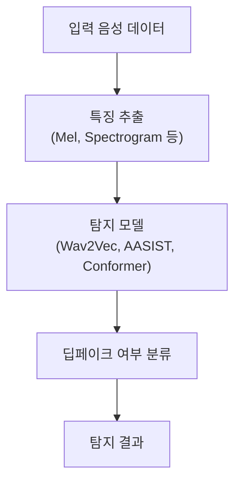

## 딥러닝 기반 음성 합성기술 개념

- TTS, 보이스 컨버전, 딥러닝 기술을 활용하여 사람의 음성을 자연스럽고 정교하게 합성하는 기술
- 최근 Transformer 기반의 음성 합성 기술로 고품질 음성 합성이 가능해져 부정적 활용 사례 증가

## 딥페이크 음성 탐지기술 개념도, 핵심요소, 악용사례

### 딥페이크 음성 탐지기술 개념도

- 입력 음성을 주파수 기반으로 분석 후, 딥페이크 탐지 모델로 학습하여 진짜/가짜 여부를 분류

### 딥페이크 음성 탐지기술 핵심요소

| 구분 | 핵심요소 | 내용 |
| --- | --- | --- |
| 데이터 처리 | 특징 추출 | Mel-frequency Cepstral Coefficients (MFCC), Spectrogram, Wav2Vec 기반 |
| 탐지 모델 | AASIST | 주파수-시간 특징 결합, 그래프 어텐션 네트워크를 적용하여 정밀 탐지 |
| 백엔드 분석 | Conformer | 전역적/지역적 특징 동시 학습, 긴 문맥 내 정보 포착으로 탐지 성능 강화 |

### 음성 딥페이크 악용사례

| 사례 | 내용 | 대응방안 |
| --- | --- | --- |
| 보이스피싱 | 가족, 직장 상사 등 신뢰도 높은 화자의 목소리를 변조해 금전 요구 | 음성 인증 및 추가적인 신원 확인 절차 강화 |
| 가짜 뉴스 | 정치인 음성을 변조해 거짓 정보를 전파 (예: 젤렌스키의 항복 선언) | 딥페이크 탐지 시스템 도입 및 음성 출처 검증 |
| 선거 조작 | 선거 직전 딥페이크 음성으로 유권자를 현혹하는 음성 유포| 미디어 모니터링 및 딥페이크 탐지 기술 활용 |
| 투자 사기 | 유명인의 변조 음성을 사용해 신뢰도를 조작, 투자 유도 | 투자 플랫폼의 음성 데이터 검증 및 사용자 인식 제고 |

## 음성 딥페이크 탐지기술의 추가적인 고려사항

| 구분 | 고려사항 | 내용 |
| --- | --- | --- |
| 제도적 측면 | 법적 규제 및 표준화 필요 | AI 음성 기술 활용 가이드라인 마련, 음성 합성과 탐지 기술의 국제 표준화 작업 강화 기술적 측면 |
| | 법안 제정 및 책임 부여 | EU 초대형 플랫폼 규제 정책, 미국 딥페이크 책임법안 사례 참조 |
| 사회적 측면 | 사용자 인식 제고 | 딥페이크 음성의 위험성을 알리고 개인 정보 보호를 강화하는 캠페인 및 교육 필요 |
| | 대중 참여형 탐지 시스템 개발 | 일반 사용자가 탐지 기술에 쉽게 접근할 수 있도록 대중 참여형 탐지 도구 및 플랫폼 제공 |

## 참조

- [IITP: 주간기술동향 2159호](https://iitp.kr/kr/1/knowledge/periodicalViewA.it?searClassCode=B_ITA_01&masterCode=publication&identifier=1344)
