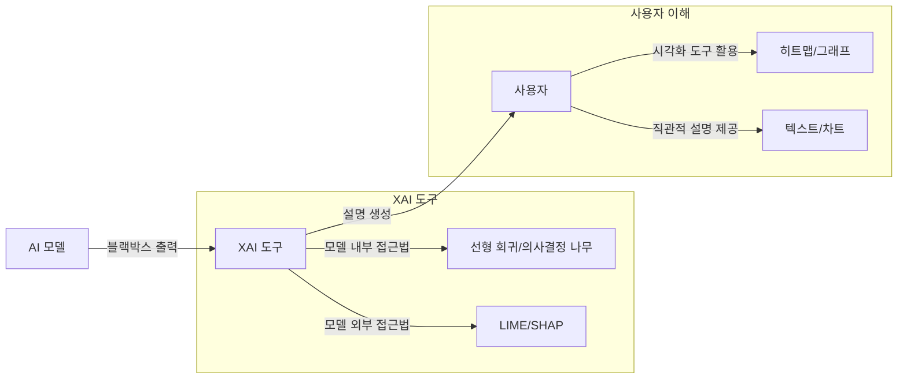

## XI 개념

- ==AI 모델의 의사결정 과정==을 사람에게 ==이해할 수 있는 형태로 설명==하는 기술
- AI 결과에 대한 신뢰성, 투명성 향상 / 금융,의료,법률 등 고위험 분야에서의 설명가능성 확보 / GDPR 규제 준수

## XAI 개념도, 핵심요소, 적용방안

### XAI 개념도

### XAI 핵심요소

| 구분 | 설명 | 비고 |
| --- | --- | --- |
| ==모델 내부 접근법== | 모델 자체가 해석 가능한 구조로 설계 | 선형 회귀, 의사결정 나무, 희소오토인코더 |
| ==모델 외부 접근법== | 블랙박스 모델의 결과를 설명하기 위한 별도의 분석 기법 | LIME, SHAP |
| ==설명 시각화 도구== | 기술적 설명을 직관적으로 전달하기 위한 그래프 및 히트맵 | 진단 시각화 |

### XAI 적용방안

| 구분 | 내용 | 적용 방안 |
| --- | --- | --- |
| 성능과 설명성 균형 | 딥러닝 모델의 높은 성능 유지와 동시에 해석 가능성을 확보하기 어려움 | 하이브리드 접근법으로 간단한 서브 모델과 복잡한 메인 모델 결합 |
| 다양한 데이터 유형 | 특정 데이터 유형(예: 텍스트, 이미지)에만 효과적인 XAI 기법 한계 | 다중 도메인 적용 가능한 범용 XAI 알고리즘 개발 |
| 보안 및 프라이버시 | 설명 가능성이 높아질수록 민감 데이터 노출 위험 증가 | 민감데이터 익명화 및 필터링 기술 도입 |
| 표준화 부족 | XAI의 구현 방식과 평가 기준이 명확하지 않음 |IEEE 및 ISO 표준화 기구의 가이드라인 개발 참여 |

## XAI 추가적인 고려사항

- 설명 시각화 도구와 직관적 인터페이스를 개발하여 사용자 이해도 향상 및 AI의 사회적 수용성 증대
