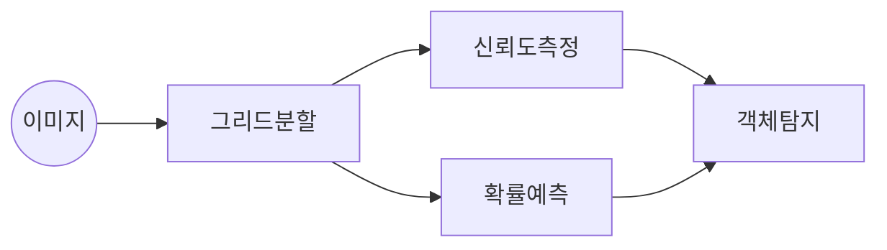

## YOLO 개념

- 실시간 객채 탐지를 위한 CV 알고리즘으로 이미지를 한 번만 보고 객체의 위치와 분류를 동시에 예측하는 기술

## YOLO 개념도, 동작 절차, 활용사례

### YOLO 개념도

- 빠른 객체 인식 속도로 사용 증가, 현재 V8 버전 모델까지 활용 가능

### YOLO 동작 절차

| 절차 | 내용 | 비고 |
| --- | --- | --- |
| 그리드 분할 | 이미지를 SxS 크기의 격자로 나눔 | 각 셀에서 객체의 존재 여부를 예측 |
| 바운딩박스생성 | 각 셀에서 객체가 존재할 가능성이 높은 바운딩 박스를 생성 | 중심 좌표(x, y), 너비(w), 높이(h), 신뢰도 포함 |
| 클래스 확률 맵 구성 | 각 바운딩 박스에 대해 클래스별 확률 계산 | 다중 클래스 분류 수행|
| 객체 참지 | 신경망을 통해 가장 가능성이 높은 바운딩 박스를 선택 | NMS(Non-Maximum Suppression) 기법 활용 중복 제거 |

### YOLO 활용사례

| 구분 | 사례 | 설명 |
| --- | --- | --- |
| 전자상거래 | 제품 검색 및 자동 태깅 | 온라인 쇼핑몰에서 제품 이미지를 분석하여 카테고리 분류 및 추천 시스템 활용 |
| 신분확인 | 생체 인식 및 보안 시스템 | 얼굴 인식 기반 출입 통제 시스템, CCTV 영상 분석을 통한 신원 확인 |
| 엔터테인먼트 | 게임 및 증강 현실(AR) 기술 | AR 게임 및 가상현실(VR)에서 객체 추적 및 인터랙티브 콘텐츠 생성 |
| 의료 | 의료 영상 분석 | X-ray, CT 스캔 이미지에서 질병 탐지 및 의료 진단 지원 |
| 자율주행 | 도로 객체 탐지 | 차량, 보행자, 신호등 등을 실시간으로 탐지하여 자율주행 시스템에 적용 |
