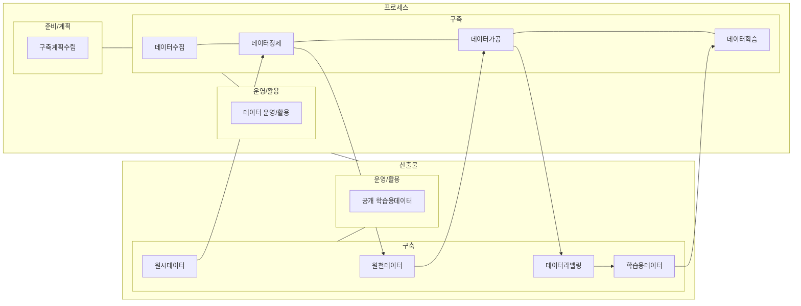

## AI HUB 개념

- AI 학습을 위한 고품질 데이터를 제공하는 플랫폼
- 데이터 접근성 향상, 데이터 품질 보증, 산업 전반의 AI활용 촉진

## AI 학습용 데이터 품질관리 개념도, 프레임워크, 품질 지표

### AI 학습용 데이터 품질관리 개념도

- 데이터 처리 전 단계에서 품질을 보장하여 데이터 신뢰성 제고 및 모델 예측 정확도와 효율성 극대화

### AI 학습용 데이터 품질관리 프레임워크

| 단계 | 프로세스 | 산출물 |
| --- | --- | --- |
| 준비/계획 | 구축 계획 수립 | 사업수행계획서, 품질관리계획서 품질지표 기준서 |
| 데이터획득/수집 | 획득/수집 기준 현행화 | 획득/수집 가이드라인, 개인정보 자율점검표, 수집도구 사용설명서, 원시데이터, 품질관리결과서, 품질검사도구 |
| 데이터정제 | 정제 방법/기준 현행화 | 정제 가이드라인, 저작도구 사용설명서, 원천데이터, 품질관리 결과서, 품질검사도구 |
| 데이터가공 | 라벨링 방법/기준 현행화 | 가공 가이드라인, 저작도구 사용설명서, 라벨링데이터, 품질관리 결과서, 품질검사 도구 |
| 데이터 학습 | 구축목적, AI모델 합치성 확인 | AI모델 설명서, AI모델 소스코드, 학습모델 파일, 모델 구축 도커이미지, AI모델 테스트 결과서, 품질검사 도구, 보완조치결과서 |

### AI 학습용 데이터셋의 품질 지표

| 구분 | 품질 지표 | 내용 |
| --- | --- | --- |
| 구축공정 | 준비성 | 품질관리를 위해 기본적으로 관리해야하는 정책, 규정, 조직, 절차 마련 및 검사 |
| - | 완전성 | 물리적 구조와 정의한 데이터 형식, 입력값 범위에 맞게 데이터가 저장되도록 설계, 구축되었는지 검사 |
| - | 유용성 | 발주기관의 요구사항이 충분히 반영되었는지, 임무정의에 적합한 데이터 범위와 상세화 정도를 충족하는지 검사 |
| 데이터 적합성 | 기준 적합성 | 다양성, 신뢰성, 충분성, 균일성, 사실성, 공평성 측정하여 학습용도로 적합한지 검사 |
| - | 기술 적합성 | 파일포맷, 해상도, 선명도, 컬러, 크기, 길이, 음질 등을 측정하여 학습용도로 적합한지 검사 |
| - | 통계적 다양성 | 데이터 편향을 방지하기 위해 클래스 분포도, 인스턴스 분포도, 문장길이, 어휘개수 등을 측정 |
| 데이터 정확성 | 구문 정확성 | 어노테이션 데이터를 구성하는 속성값과 정의된 데이터 형식, 입력값 범위와 일치성 측정 |
| - | 의미 정확성 | 데이터 참값을 확인하기 위해 정확도, 정밀도, 재현율, IoU, ROUGE, BLEU, Fβ-점수, EM 등 측정 |
| 학습모델 | 알고리즘 적정성 | 알고리즘을 태스크 단위로 구분하여 사업 수행기관이 제시하는 학습모델의 태스크 적정성 판단 |
| - | 유효성 | 학습용 데이터로 학습시키는데에 적합한 인공지능 알고리즘의 유효성 측정 |

## AI HUB 성공포인트

- 최신 데이터를 주기적으로 업데이트하여 AI파트너, AI생산자에게 최신트랜드와 패턴 학습 기회 제공
