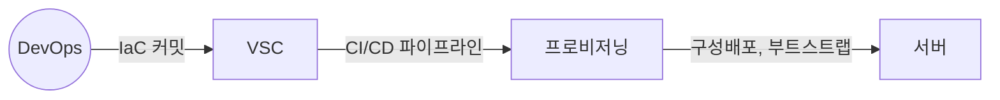

## IaC의 개념

- 인프라 구성 및 제어를 수동으로 관리하는 대신 코드로 정의하고 관리하는 기법
- 휴먼에러 방지, 자동화, 일관성, 버전 관리

## IaC의 구성도, 구성요소, 장점

### IaC의 구성도

### IaC의 구성요소

| 구분 | 내용 | 비고 |
| --- | --- | --- |
| 버전관리시스템 | 코드 변경사항 추적 및 관리 | Git |
| 파이프라인 | 코드 통합, 테스트, 배포 자동화 | ArgoCD |
| 프로비저닝 | 인프라를 코드로 정의, 배포 | Ansible, Terraform |
| 부트스트랩 | 어플리케이션 배포에 필요한 설정 관리 | Docker, Helm |

### IaC의 장점

| 구분 | 장점 | 비고 |
| --- | --- | --- |
| 비용효율측면 | 작업시간 단축 | 반복작업 자동화 |
| - | 예방비용 감소 | 인프라 단위 테스트 |
| 에러관리 측면 | 휴먼에러 감소 | 코드리뷰, 실수방지 |
| - | 빠른 롤백 | 구성 실패시 이전버전 롤백 |

- 개발 환경 구축과 배포 프로세스를 자동화하여 DevOps, GitOps 기술 요구사항 충족

## IaC 고려사항

- 보안 관련 정보 추가시 파이프라인 내부 Secret Variable로 관리 필요
