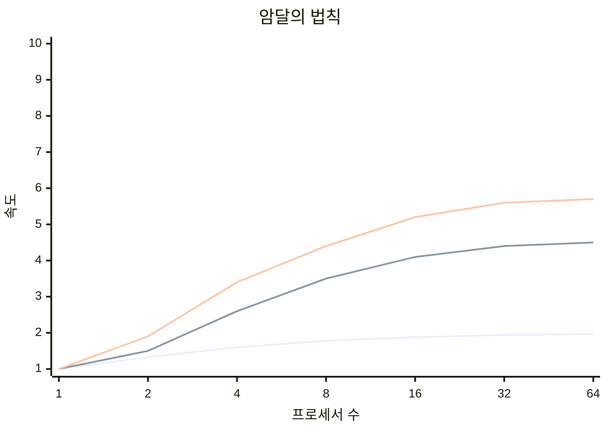

## 암달의 법칙 개념

- 컴퓨터 시스템의 ==일부를 개선할 때== 전체적인 ==성능향상의 최대 폭이 제한==된다는 법칙
- ==병렬 컴퓨팅에서== 멀티프로세서 사용시 ==성능향상의 최대폭이 순차적인 프로그래밍 때문에 제한==되는 것을 증명

## 암달의 법칙 개념도, 구성요소, 활용 예시

### 암달의 법칙 개념도

### 암달의 법칙 구성요소

$$
\frac{1}{(1 - P) - \frac{P}{S}}
$$

- P = 전체 작업시간의 부분
- S = 성능 향상
- 반비례 관계로 최대 성능의 향상폭 제한

### 암달의 법칙 활용 예시

| 구분 | 예시 | 내용 |
| --- | --- | --- |
| 설계 | CPU 설계시 최대 트랜지스터 제한 | 트랜지스터 수를 늘려 단위시간 당 최대 성능향상 지점 파악 |
| - | GPU 설계시 FPU, ARU 갯수 조정 | FPU, ALU의 갯수를 조정하여 병렬 컴퓨팅 최대효과 추적 |
| 분석 | 하드웨어 규모산정 | CPU, 메모리 등 시스템 규모산정시 스케일업 규모 파악 |
| 최적화 | 멀티쓰레딩 최적화 | 쓰레드의 수를 증가시켜 병렬 처리의 이점을 극대화하면서 병목 현상 분석 |
