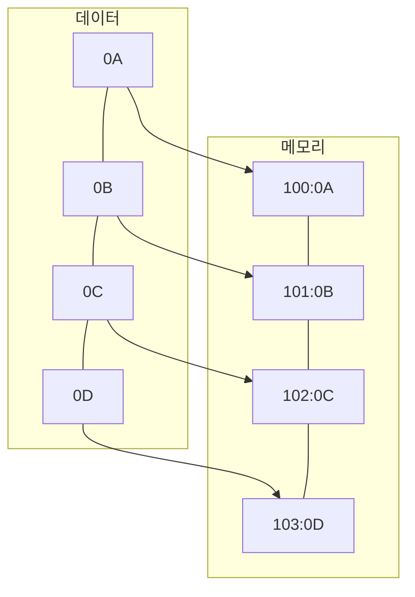
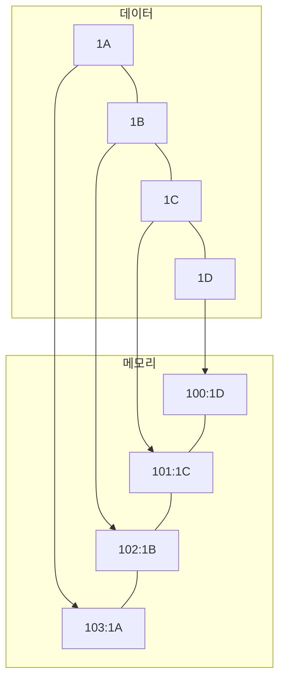

## 빅 엔디언, 리틀 엔디언의 개념

- 빅 엔디언: 데이터를 메모리에 적재시 메모리 시작 주소에 데이터의 상위 바이트부터 순차 저장하는 방식
- 리틀 엔디언: 데이터를 메모리에 적재시 메모리 시작 주소에 데이터의 하위 바이트부터 순차 저장하는 방식

## 빅 엔디언, 리틀 엔디언 개념도, 세부 요소, 적용사례

### 빅 엔디언, 리틀 엔디언 개념도

### 빅 엔디언, 리틀 엔디언 세부 요소

| 구분 | 빅 엔디언 | 리틀 엔디언 |
| --- | --- | --- |
| 저장방식 | 낮은 주소에 MSB부터 저장, 앞쪽부터 스택에 푸쉬 | 낮은 주소에 LSB부터 저장, 뒤쪽부터 스택에 푸쉬 |
| 장점 | 우수한 가독성, 디버깅 편의성, 빠른 비교 연산 | 후위 비트만 사용하는 계산 용이, 올림 연산 빠른, 가산기 구현 단순 |
| 단점 | 수학 연산 어려움, 타입캐스팅 느림 | 숫자 비교 느림, SW 디버깅 불편 |
| 대표회사 | IBM | Intel, AMD |

### 빅 엔디언, 리틀 엔디언 적용사례

| 구분 | 빅 엔디언 | 리틀 엔디언 |
| --- | --- | --- |
| N/W 프로토콜 | TCP/IP 주소 전송 | N/A |
| 운영체제 | 일부 유닉스 시스템 | 윈도우, 맥, 리눅스 |
| CPU 아키텍처 | IBM 메인프레임, 모토로라 프로세서 | x86, ARM 등 대부분 CPU |

## 빅 엔디언, 리틀 엔디언, N/W 측면 고려사항

- N/W 데이터 전송시 ntohl, htonl 함수를 사용하여 목적지 바이트 순서 변경 필요
