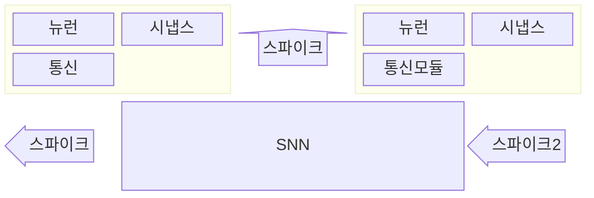

## 뉴로모픽 칩의 개요

- 인간의 ==뇌를 모방==하여 ==정보를 연산, 저장==하는 비 폰노이만 구조의 ==저전력, 고성능 칩==
- 기존 폰노이만 구조의 프로세서로 연산하기 어려운 인공지능, 시뮬레이션 등 ==병렬 작업을 처리==하기 위해 필요

## 뉴로모픽 칩의 구성도, 구성요소, NPU와 비교

### 뉴로모픽 칩의 구성도

### 뉴로모픽 칩의 구성요소

| 구분 | 내용 | 비고 |
| --- | --- | --- |
| ==뉴로모픽 칩== | ==시냅스와 뉴런==으로 구성, 스파이크 자극에 의해 유기적으로 자율 조절 | 인간 뇌와 같이 저전력으로 학습 |
| ==스파이킹 신경망, SNN== | 생물학적 신경 네트워크 구조를 모방 | 대규모 병렬 연산, 가중치 전달 |
| ==뉴로모픽 소자== | 뉴런과 시냅스를 구성하는 핵심 소자로 메모리와 레지스터의 결합 | ==멤리스터== |
| ==PIM== | 뉴런을 배열하여 ==스파이크 입력 변환==, 뉴런 배열에서의 ==스파이크 발화 동작 및 학습==, ==학습 결과 특성 분류== 수행 | ==SRAM 기반== |

### NPU와 뉴로모픽 침의 차이점

| 구분 | ==NPU== | 뉴로모픽 칩 |
| --- | --- | --- |
| 구조 | ==폰노이만== | 생물의 뉴런 시스템 |
| 목적 | ==GPU를 CPU로== 만들어 연산 활용 | ==메모리를 CPU로== 만들어 연산 활용 |
| 중점 | ==인공신경망 연산==의 효율적 수행 | 인공신경망 외 다양한 프로그램 연산 |
| 관련 업체 | 엔비디아 등 | IBM, 인텔 등 |
| 장점 | LLM 등 인공지능 모델 확산 기여 | 전력, 면적, 성능 등에서 압도적 결과 |
| 단점 | 대규모 데이터센터 공간/전력 소모 | 뉴로모픽 칩 개발의 어려움 |

## 뉴로모픽 칩 고려사항

- 뉴로모픽 하드웨어를 최대한 활용할 수 있는 ==알고리즘== 및 SW개발, 연구 병행 필요
