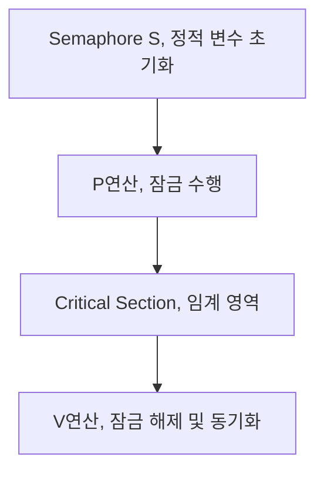

## 세마포어의 개념

- ==멀티 프로그래밍 환경==에서 두 개의 ==원자적 함수로 공유 자원에 대한 접근을 제한==하는 방법
- ==임계구역에 상호접근==할 수 있는 기능을 수행하여 ==교착상태에 빠지지 않도==록 함

## 세마포어 개념도, P연산, V연산

### 세마포어 개념도

### 세마포어 연산

| 구분     | P 연산, Wait                                         | V 연산, Signal                                    |
| -------- | ---------------------------------------------------- | ------------------------------------------------- |
| 개념     | 리소스에 접근하기 위해 다른 태스크가 끝나기까지 대기 | 임계영역을 나오면서 다른 태스크가 접근하도록 변경 |
| 로직     | 세마포어 S의 Count를 1 ==감소==                          | 세마포어 S의 Count를 1 ==증가==                       |
| 슈도코드 | `P(S) { while S <= 0; S--; }`                        | `V(S) { S++; }`                                   |

- 세마포어에 접근시킬 스레드의 갯수에 따라 이진 세마포어, 계수형 세마포어 선택

### 세마포어의 유형

| 구분            | 내용                                              | 비고       |
| --------------- | ------------------------------------------------- | ---------- |
| ==이진 세마포어==   | 상호배제나 프로세스 동기화 목적으로 사용          | 0 or 1     |
| ==계수형 세마포어== | 초기에 동시에 진입 가능한 프로세스 개수 정의 가능 | 0,1,2,3... |

## 세마포어 고려사항

- 세마포어의 직접 제어로 인한 오류 가능성, 난해성을 보완하기 위해 ==프로그래밍 언어 수준에서 모니터 기법== 사용.
